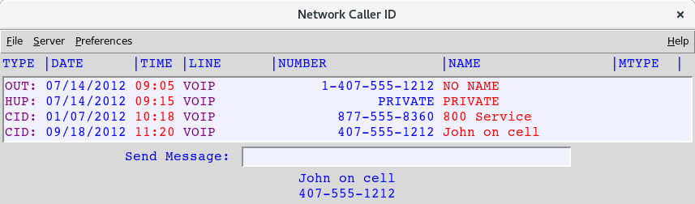
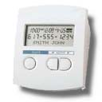
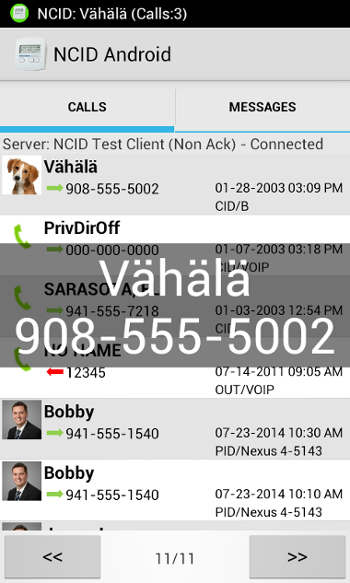
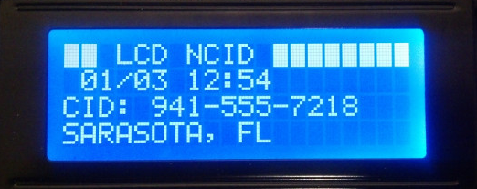
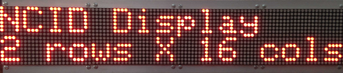

<!-- Clients.md - Removable HEADER Start -->

Last edited: Apr 12, 2016

<!-- Removable HEADER End -->

##  Supported Clients

> [Table of Contents](#doc_top)

### Clients Index

> [Overview](#clients_ov)  
  [ncid](#clients_ncid)  
  [NCIDpop](#clients_pop)  
  [NCID Android](#clients_android)  
  [LCDncid](#clients_lcd)  
  [NCIDdisplay](#clients_display)

###  Overview

> The primary NCID distribution includes one "universal" Graphical User Interface (GUI) client
  that runs under the Unix scripting language called Wish (Windowing Shell). In addition, there
  are four optional clients, available as separate downloads, all of which are actively maintained by
  the NCID Development Team.

> There is a [3rd Party Addons](http://ncid.sourceforge.net/addon.html) page that links to clients,
  gateways, and related NCID projects by other developers and users.  Contact us with a URL showing
  your project and we will provide a link to it.

> The five clients are ncid, NCIDpop, NCID Android, LCDncid, and NCIDdisplay.

#### ncid

> The `ncid` client is cross-platform for Linux, Mac OSX, and Windows. It is included with the
  NCID distribution. The Windows version can only run the client without output modules.  

> [Description, Features](http://ncid.sourceforge.net/ncid/features.html#ncid_client)
  and [Screenshots](http://ncid.sourceforge.net/ncid/screenshots.html)

> Basic steps for starting the client:

> * Make sure a window manager is running (e.g., X-Windows).

> * Launch a graphical Terminal application (e.g., **xterm**).

> * Make sure `ncidd` is running.

> * To run `ncid` on the **same** computer as `ncidd`, at the Unix shell prompt, type in:.
>> `ncid &`
 
> * To run `ncid` on a **different** computer, specify the hostname or IP address of the `ncidd` computer:
>> `ncid 192.168.1.5 &`
 
#### NCIDpop

> NCIDpop is an optional cross-platform popup client for Linux, Mac OSX, and Windows.

> [Description, Features, and Screenshots](http://ncid.sourceforge.net/ncidpop/ncidpop.html)

> Basic steps for starting the client:

> * Click on the NCIDpop program icon.

> * The first time NCIDpop runs it should take you to the General tab on the Preferences window.

> * In the Server Settings box, type the hostname or IP address of the NCID server, e.g., 192.168.1.5.

> * Click the Set button.

#### NCID Android

> NCID Android is an optional client for Android running on smartphones and tablets.

> [Description, Features, and Screenshots](http://ncid.sourceforge.net/ncidandroid/ncidandroid.html)

> Basic steps for starting the client:

> * Tap the NCID Android program icon.

> * The first time NCID Android runs it should take you to the Preferences window.

> * Tap Server Settings.
> * Tap Hostname and type the hostname or IP address of the NCID server, e.g., 192.168.1.5.

> * Tap the OK button.

> * Click on the BACK button until you get back to the screen showing Calls and Messages.

#### LCDncid

> LCDncid is an optional client that requires an LCD module connected to a Raspberry Pi or other computer.

> [Description, Features, and Screenshots](http://ncid.sourceforge.net/lcdncid/lcdncid.html)

> Basic steps for starting the client:

> * You can run the NCID server and LCDncid client on the same device; the configuration file **lcdncid.conf** should have suitable defaults already.

> * If the LCDncid client is not running on the same device as the NCID server, you'll need to
    edit **lcdncid.conf** and set the <u>ncidhost</u> variable to the hostname or IP address, e.g.:

>> `ncidhost = 192.168.1.5`

#### NCIDdisplay

> NCIDdisplay is an optional giant (3"x18"!) homebrew LED display made up of at least 4 LCD modules.

> [Description, Features, and Screenshots](http://ncid.sourceforge.net/nciddisplay/nciddisplay.html)

> Basic steps for starting the client:

> * NCIDdisplay is more involved than the other clients listed above because it requires the completion of its build-it-yourself hardware project.
 
> * When properly built, NCIDdisplay will run by simply powering it on.
