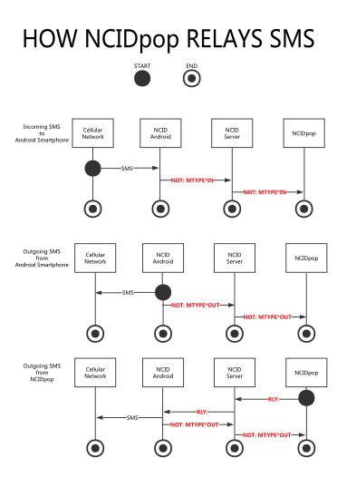

<!-- NCID-API.md -->

<head>
<!-- without this, some browsers will render '&nbsp;' as '&#194;' -->
<meta charset="UTF-8">
</head> 

<!-- see tail end of this file for markdown editor specific formatting/layout notes -->

<!-- Haroopad won't render centered heading - outputs '#' as-is -->

 
# NCID API Documentation

API 1.5

Last Edit: November 6, 2016

Copyright (C) 2010-2016

John L Chmielewski

Todd A Andrews

This document contains information needed to develop servers, clients, 
client output modules, and gateways for NCID (Network Caller ID). 

All example phone numbers and names contained herein are intended to be fictional.

There are 5 feature sets of NCID conformance:

-   Feature Set 1: Modem and Device Support (required)

-   Feature Set 2: Gateway Support (optional)

-   Feature Set 3: Client Job Support (optional)

-   Feature Set 4: Acknowledgment Support (optional)

-   Feature Set 5: Relay Job Support (optional)

<!--
[## Table of Contents]
-->

##  Table of Contents

> **[Before you begin](#b4-begin)**

>> [ABOUT CONFIGURATION OPTIONS FOR SERVER IMPLEMENTATIONS](#about-config)

>> [ABOUT FIELD PAIRS AND LINE TYPES ](#about-pairs)

>> [GENERAL NOTES ON NAME, NMBR, LINE AND MESG FIELD DATA](#gen-text)

>> [GENERAL NOTES ON DATE AND TIME FIELD DATA](#gen-datetime)

>> [ENSURING CONNECTIVITY WITH THE SERVER](#connectivity)

>> [COMPANION DOCUMENTS](#companion)

> **[Feature Set 1: Modem and Device Support](#fs1-modem-support)**

>> [SERVER IMPLEMENTATION](#fs1-server-impl)

>>> [Server Output Lines](#fs1-server-output)

>>> [Server Alias Support](#fs1-alias-support)

>>> [Server Hangup Support](#fs1-hangup-support)

>>> [Modem-to-Server](#fs1-modem2server)

>>> [Optional Server Extensions](#fs1-server-ext)

>>> [Optional Server Hangup Extension](#fs1-hangup-ext)

>>> [Optional NetCallerID Device-to-Server](#fs1-netcid2server)

>>> [Optional TCI Device-to-Server (new in API 1.1)](#fs1-tci2server)

>> [CLIENT IMPLEMENTATION](#fs1-client-impl)

>>> [Client-to-Server](#fs1-client2server)

>>> [Optional Client-to-Module](#fs1-client2module)

>>> [Optional Client-to-TiVo Display](#fs1-client2tivo)

> **[Feature Set 2: Gateway Support](#fs2-gw-support)**

>> [SERVER IMPLEMENTATION](#fs2-server-impl)

>>> [Server-to-Gateway](#fs2-server-output)

>> [GATEWAY IMPLEMENTATION](#fs2-gw-impl)

>>> [Gateway-to-Server](#fs2-gw2server)

>>> [Forwarding Gateway (Server-to-Server) (new in API 1.4)](#fs2-fwdgw)

>> [CLIENT IMPLEMENTATION](#fs2-client-impl)

>>> [Optional Client-to-Module](#fs2-client2module)

> **[Feature Set 3: Client Job Support](#fs3-client-job-support)**

>> [OVERVIEW OF AVAILABLE CLIENT JOBS](#fs3-overview)

>> [SERVER IMPLEMENTATION](#fs3-server-impl)

>>> [Server Output Lines](#fs3-server-output)

>> [CLIENT IMPLEMENTATION](#fs3-client-impl)

>>> [Client-to-Server](#fs3-client2server)

>> [CLIENT JOB EXAMPLES](#fs3-examples)

> **[Feature Set 4: Acknowledgment Support](#fs4-ack-support)**

>> [SERVER IMPLEMENTATION](#fs4-server-impl)

>>> [Server Output Lines](#fs4-server-output)

>> [GATEWAY IMPLEMENTATION](#fs4-gw-impl)

>>> [Gateway-to-Server](#fs4-gw2server)

>> [CLIENT IMPLEMENTATION](#fs4-client-impl)

>>> [Client-to-Server](#fs4-client2server)

> **[Feature Set 5: Relay Job Support (new in API 1.4)](#fs5-relay-job-support)**

>> [RELAY JOB OVERVIEW](#fs5-overview)

>> [SERVER IMPLEMENTATION](#fs5-server-impl)

>> [RELAY JOB ORIGIN (RJO) IMPLEMENTATION](#fs5-origin-impl)

>>> [RJO Line Type Definition](#fs5-def-rjo)

>> [RELAY JOB TARGET (RJT) IMPLEMENTATION](#fs5-target-impl)

>>> [RJT Line Type Definition](#fs5-def-rjt)

>> [RELAY JOB EXAMPLES](#fs5-examples)

> **[Sending a Text Message](#sending-messages)**

> **[Country Codes](#country-codes)**

> **[Emulation Programs and Test Files](#emulation)**

> **[Appendix A: Quick Reference List of all call type line identifiers](#quick-ref-call-types)**

> **[Appendix B: Index to all line type definitions](#index-line-types)**

> **[Appendix C: Quick Reference List of all server configuration settings](#quick-ref-serv-config)**

> **[Appendix D: More info about modem MESG hexadecimal characters](#modem-mesg-hex)**

> **[Appendix E: SMS Relay Job sequence diagram (new in API 1.4)](#ncidpop-sms-relay)**

> **[API Version Change History](#api-history-top)**

>> [Release Summary](#api-release-summary)

>> [Version 1.5](#api-history-1.5)

>> [Version 1.4](#api-history-1.4)

>> [Version 1.3](#api-history-1.3)

>> [Version 1.2](#api-history-1.2)

>> [Version 1.1](#api-history-1.1)

>> [Version 1.0](#api-history-1.0)

> **[Documentation Change History](#doc-history-top)**

>> [November 6, 2016](#doc-history-2016-11-06)

>> [September 30, 2016](#doc-history-2016-09-30)

>> [July 23, 2016](#doc-history-2016-07-23)

>> [May 7, 2016](#doc-history-2016-05-07)

>> [December 29, 2015](#doc-history-2015-12-29)

<!--
[## Before you begin]
-->

##  Before you begin

<!--
[### ABOUT CONFIGURATION OPTIONS FOR SERVER IMPLEMENTATIONS]
-->

> ###  ABOUT CONFIGURATION OPTIONS FOR SERVER IMPLEMENTATIONS

>> This API document attempts to describe server interactions with
gateways, client, extensions, etc. without regard to a specific operating 
system or specific programming methods and conventions. However, for the 
purpose of reading this document we will reference configuration options 
using the following convention:

>>**&lt;configuration file name::setting name&gt;**

>> In the case of the official NCID distribution for Unix/Linux platforms, 
there are several configuration files. Here are just a few of them:

>>>
Purpose                   | Unix/Linux File Name | Convention used in this API
--------------------------|----------------------|:---------------------------
Server settings           | ncidd.conf           | **&lt;ncidd.conf::setting name&gt;**
Alias mappings            | ncidd.alias          | **&lt;ncidd.alias::alias definition&gt;**
Blacklist                 | ncidd.blacklist      | **&lt;ncidd.blacklist::call name or number&gt;**
Whitelist                 | ncidd.whitelist      | **&lt;ncidd.whitelist::call name or number&gt;**
Universal Client settings | ncid.conf            | **&lt;ncid.conf::setting name&gt;**
SIP Gateway settings      | sip2ncid.conf        | **&lt;sip2ncid.conf::setting name&gt;**
YAC Gateway settings      | yac2ncid.conf        | **&lt;yac2ncid.conf::setting name&gt;**

>> An example of a setting name in the server configuration file would be 
   `lockfile`. Within this document you would see the setting referenced as **ncidd.conf::lockfile**.

>> If a developer wishes to create his or her own NCID server, any configuration
   file name and setting name convention desired can be used. For example, an 
   NCID server for Windows might use a file name called **ncid-server.ini** 
   and a setting called **LockFile=**. 

>> Using the **&lt;configuration file name::setting name&gt;** convention allows a 
developer to correlate the setting names referenced in this API with the
developer's own conventions. In this regard, you can think of
**&lt;configuration file name::setting name&gt;** as a reference to a concept
or definition. **ncidd.conf::lockfile** therefore refers to the path of
the server's serial port lock file. An alphabetized summary of all server options,
including a brief description, can be found in 
[Appendix C: Quick Reference List of all server configuration settings](#quick-ref-serv-config).

<!--
[### ABOUT FIELD PAIRS AND LINE TYPES]
-->

> ###  ABOUT FIELD PAIRS AND LINE TYPES

>> The reason for the following restrictions is to allow future NCID 
   programs and scripts to be as backward compatible as possible. This is
   particularly important in the case of third party software that may
   not be updated at the same time as a new NCID release.

>> ### Field Pairs

>> A field pair is defined as &lt;field label&gt;&lt;field data&gt;,
   with zero or more delimiter characters between them.
   
>> The very first field pair for a line **might** begin with the three 
   characters \#\#\# to indicate the data is being sent TO the server, or 
   begin with the three characters \*\*\* to indicate the data is being
   received FROM the server.
   
>> **It is very important NOT to assume that the <u>order</u> of field 
     pairs will always be the same across NCID versions.** 
     
>>   For example, if today a hypothetical layout of field pairs looks like this:
 
>>> `XYZ: ***DATE*<date>*TIME*<time>*LINE*<lineid>*NMBR*<number>*MESG*<hexchars>*NAME*<name>*`

>>  There is no guarantee that the order won't be changed. Perhaps a
     future version would swap MESG and NAME:

>>> `XYZ: ***DATE*<date>*TIME*<time>*LINE*<lineid>*NMBR*<number>*NAME*<name>*MESG*<hexchars>*`

>> Another example showing ###/.../+++ field delimiters for the field 
    pairs:
   
>>> `ABCD: ###DATE<datetime>...CALL<type>...LINE<lineid>...NMBR<number>...NAME<name>+++`

>> might someday get changed to put NMBR and NAME first:

>>> `ABCD: ###NMBR<number>...NAME<name>...DATE<datetime>...CALL<type>...LINE<lineid>+++`
   
>> Any programs or scripts you develop on your own must be flexible in
    parsing out &lt;field label&gt;&lt;field data&gt;, wherever they
    might be located in a line.
   
>> ** It is very important for a program or script to ignore
     &lt;field label&gt;&lt;field data&gt; pairs that it does not 
     recognize. **
     
>>   For example, if at some point in the future a new field
     pair with the hypothetical label of JJJJ was added, your programs
     or scripts should not trigger a fatal error. And it might be
     added at any location in the line, not just at the end:

>>> `XYZ: ***DATE*<date>*TIME*<time>*LINE*<lineid>*NMBR*<number>*JJJJ*<data>*MESG*<hexchars>*NAME*<name>*`

>>> `ABCD: ###DATE<datetime>...CALL<type>...LINE<lineid>...NMBR<number>...JJJJ<data>...NAME<name>+++`

>> ### Line Types

>> - It is very important for a program or script to ignore line types
     (e.g., 200, 210, 
     CID:, HUP:, 
     REQ: etc.) that it does not recognize. It
     should not trigger a fatal error.
    
<!--
[### GENERAL NOTES ON NAME, NMBR, LINE AND MESG FIELD DATA]
-->

> ###  GENERAL NOTES ON NAME, NMBR, LINE AND MESG FIELD DATA

>> ### NAME  

>> - a string of characters that indicates the Caller ID name from a 
     modem, gateway or smartphone, or a name alias 

>> - can include embedded spaces (do not surround with quotes)

>> - can include punctuation marks

>> - can be one of the special names OUT-OF-AREA, ANONYMOUS, and PRIVATE

>> - if there is no name, it should not be left blank (although this is 
     not strictly enforced and you may get unpredictable results), but 
     instead should contain NO NAME or a dash ("-") 

>> - name should not exceed 50 characters, and in particular the NCID 
     server enforces an alias maximum length of 50. On smartphones the NAME 
     becomes the SMS text, and be aware that some smartphones send messages 
     several hundred bytes in length. 

>> ### NMBR

>> - a string of characters that indicates the Caller ID number from a 
     modem, gateway or smartphone, or a number alias 

>> - usually does not have embedded spaces

>> - if punctuation marks are present, it is usually a dash ("-")

>> - can be one of the special names OUT-OF-AREA, ANONYMOUS, and PRIVATE

>> - if there is no number, it should not be left blank (although this is 
     not strictly enforced and you may get unpredictable results), but 
     instead should contain NO-NUMBER or a dash ("-"). The general size limit 
     in the telephone industry is 15 characters or less. 

>> ### LINE

>> - referred to as &lt;lineid&gt; in this API, it is a string of characters 
     that identifies the origin telephone line of a call from a modem, 
     smartphone or gateway, or a device identifier for a message 

>> - usually does not have embedded spaces

>> - usually does not have punctuation marks

>> - usually no more than six characters

>> - you can apply aliases to LINE data

>> - if there is no lineid, it should not be left blank (although this is 
     not strictly enforced and you may get unpredictable results), but 
     instead should contain NO-LINE or a dash ("-"). 

>> ### MESG

>> - if present, a string of hexadecimal characters that represent raw 
>>   caller ID data bytes that the modem does not understand
>>   (see [Appendix D: More info about modem MESG hexadecimal characters](#modem-mesg-hex))
>>   
>> - this is a rarely populated field and should not be confused with the
>>   MSG: and NOT: call line types 
     
>> -  NCID does not currently interpret the MESG code in any way but simply captures
>>    it and sends it on to listening clients

>> - no defined length limit

>> - if there are no hexadecimal characters, it should not be left blank 
>>   when populating the field pair (although this is not strictly enforced 
>>   and you may get unpredictable results), but instead should contain NONE
>>   or a dash ("-") 

>> ### The Dash

>> - When a call or message has an unknown NAME, NMBR, LINE or MESG the 
     field may contain the text NO NAME, NO-NUMBER, NO-LINE or NONE 
     respectively. Clients should also allow for any of these fields to be a 
     single dash to suppress the text from being displayed, that is, if the 
     field data contains a dash don't show anything. 

<!--
[### GENERAL NOTES ON DATE AND TIME FIELD DATA]
-->

> ###  GENERAL NOTES ON DATE AND TIME FIELD DATA

>> ### DATE

>> The general rule of thumb is that dates related to call data will
   already be passed from the telco to NCID in the correct format for
   the country where NCID is running -- month/day or day/month -- as 
   provided by the modem or other device. They will in turn be stored 
   in the call log in the same format.

>> There are two exceptions:

>> - If NCID does not detect a DATE field pair it will create one from
     the current date. Be aware that such dates will always be in the
     format month/day regardless of the country where NCID is running.
    
>>> (New in API 1.4) The field pair contents of RLY: 
    line types are NOT checked at all and are expected to include the 
    DATE field pair.
    
>> - The call accounting END: line type has
     three date-like field pairs: 
     
>>> - DATE, which will come from the modem or device and falls under
    the general rule of thumb above
       
>>> - SCALL and ECALL, which represent the start and end of a call
    for call accounting, will always be in the format month/day.

>> ### &lt;datetime&gt;

>> - This is a date and time "combo" field where the date is only four 
     digits (mmdd or ddmm) and the time is the normal four (hhmm) as
     described in the next section, TIME. The four digit date follows the
     general rule of thumb above.       
      
>> ### TIME

>> - All TIME fields are expected to be in military style 24-hour format
     (hours 0-23). Clients have the option of converting to 12-hour AM/PM
     format.

>> - If NCID does not detect a TIME field pair it will create one from
     the current time.

>>> (New in API 1.4) The field pair contents of RLY:
    line types are NOT checked at all and are expected to include the 
    TIME field pair.
          
>> - NCID does not care or know anything about time zones.

<!--
[### ENSURING CONNECTIVITY WITH THE SERVER]
-->

> ###  ENSURING CONNECTIVITY WITH THE SERVER

<!--

John Gruber's 'markdown' Perl script doesn't seem to consistently convert
lines like the following to html:

     &gt;&gt;  -  ##### &lt;font color=&quot;red&quot;&gt;\\n (newline)&lt;/font&gt;
     
gets rendered with the ##### as-is instead of being convert to h5 tags:

     &gt;&gt;  -  ##### &lt;font color=&quot;red&quot;&gt;\\n (newline)&lt;/font&gt;
     
so use the equivalent &lt;h5&gt; tags:

     &gt;&gt;  -  &lt;h5&gt;&lt;font color=&quot;red&quot;&gt;\\n (newline)&lt;/font&gt;&lt;/h5&gt;

Or, just use 'pandoc' instead of 'markdown':

     pandoc -o NCID-API.html NCID-API.md

-->

>> There are three different methods that clients and gateways can use
   to test their connection to the server.

>> - ##### \\n (newline)

>>> Supported in Feature Set 1. This is the most basic method. A client 
    or gateway simply sends a \n to the server
    and checks for errors. The server will make a note in its log that 
    it received a blank line, but otherwise ignores it. The server does
    not send any response.

>> - ##### REQ: YO

>>> Supported in Feature Set 2. A client or gateway can send 
    REQ: YO and expect an
    ACK: REQ YO response from the server.
   
>> - ##### REQ: ACK

>>> Supported in Feature Set 4. A client or gateway can send 
    REQ: ACK &lt;commands and arguments&gt;  and 
    expect an ACK: REQ ACK &lt;commands and 
    arguments&gt; response from the server. 
    ACK: REQ ACK sets an "ack" flag for the
    client that tells the server to acknowledge gateway 
    CALL:, CALLINFO:,
    and NOT: lines. In other words, the server 
    is expected to echo back all commands and arguments it receives.

<!--
### COMPANION DOCUMENTS
-->

> ###  COMPANION DOCUMENTS

>> You may wish to have the following documents handy as you work with
   the API:
   
>> ### User Manual:

>>> - ["Using NCID" chapter -> "Using Aliases" section](http://ncid.sourceforge.net/doc/NCID-UserManual.html#alias_top)

>>> - ["Using NCID" chapter -> "Using Hangup" section](http://ncid.sourceforge.net/doc/NCID-UserManual.html#hangup_top)

   
<!--
[## Feature Set 1: Modem and Device Support]
-->

##  Feature Set 1: Modem and Device Support

<!--
[### FS1: SERVER IMPLEMENTATION]
-->

> ###  SERVER IMPLEMENTATION

>> If you want to implement a server to communicate with NCID clients
and gateways:

>> - listen to port 3333 for a connection or whatever port is specified
    by **ncidd.conf::port**

>> - send a 200 text message to identify the 
    server and version

>> - send a 210 text message to identify the 
    API version and supported feature sets

>> - (New in API 1.5) immediately after sending a 210 line,
     receive and process zero or more HELLO: lines

>> - check server 
    **ncidd.conf::send cidlog** to determine whether to send the call log      
      
>>> - if not configured to send it, send a 
     251 Call log not sent message 

>>> - if configured to send it but it is empty, send a 
     252 Call log empty message

>>> - if configured to send it but the file does not exist, send a
     253 No call log message
    
>>> - if configured to send it and it is not empty, send the call log 
     and end with a  250 End of call log
     message

>> - optionally, send a list of server-supported Client Job options to 
    client, one OPT: &lt;option&gt; line for 
    each option

>> - if a server setting is being temporarily overridden by a 
     HELLO: CMD: &lt;command&gt; line,
     clear the override so it will not apply to future connections.

>> - send a 300 End of server startup message

>> - putting all of the above together, a typical client connection
    start-up looks like this:
>>>          
200 Server: ncidd (NCID) x.x  
210 API x.x Feature Set x x x x ...  
Client Sent: HELLO: IDENT: client ncid (NCID) x.x
Client Ident: client ncid (NCID) x.x
CIDLOG: \*DATE\*12012015\*TIME\*0028\*LINE\*HOME\*NMBR\*...  
HUPLOG: \*DATE\*12012015\*TIME\*0105\*LINE\*HOME\*NMBR\*...  
...  
250 End of call log  
OPT: hangup-1  
OPT: ...  
300 End of connection startup
          

>> - when a call is received:

>>> - if configured by **ncidd.conf::send cidinfo** to send ring info, send a 
    CIDINFO: line at each ring with a LINE
    indicator (default '-') and the ring count

>>> - generate an alias for the name, number and/or line if it is in the 
    alias file

>>> - if optional Internal Hangup support (**ncidd.conf::hangup**) is 
    implemented:

>>>> - hangup a call if it is in the **ncidd.alias** file
     but not in the **ncidd.whitelist** file

>>>> - send a HUP: line to connected clients
     when an incoming call is automatically terminated

>>> - otherwise, if the call is not being terminated, send a 
    CID: line to connected clients when a call
    is received

>>> - send a CIDINFO: line after ringing stops,
    with a ring count of 0

>> - send a MSG: line to connected clients with
   an important server warning or a user message

>> - maintain a constant TCP connection with the clients

>> - allow clients to send a \\n (newline) to
     determine if the server is still available but ignore it (no
     response is sent back to the client)

>> - detect clients as they come and go

>> - (New in API 1.4) if a line type begins with "+" (e.g., 
     +CID), strip the leading "+" and 
     send it to all listening clients; these represent lines received
     from a [Forwarding Gateway](#fs2-fwdgw)

<!--
[### FS1: Server Output Lines]
-->         

>> 
>> ### Server Output Lines

>> When the server sends information to a client or gateway, it sends the
   data as lines of text that start with a line label. This defines line
   types. The current line labels are:

>> - 200

>>> The server version message. The wording stays the same, but the 
    version number changes each time the server is updated.

>>> For example, if the server was version 1.0:

>>>> `200 Server: ncidd (NCID) 1.0`

>> - 210

>>> The server API version and feature sets. This is to inform clients 
    and gateways what features are implemented. All supported feature 
    sets must be included.

>>> For example, if the API version is 1.0 then four feature sets are
    supported:

>>>> `210 API 1.0 Feature Set 1 2 3 4`

>> - 250 - 253

>>> A call log message sent at server startup:

>>>> `250 End of call log`

>>>> `251 Call log not sent`

>>>> `252 Call log empty`

>>>> `253 No Call log`

>> - 300

>>> End of the connection startup message:

>>>> `300 End of connection startup`

>> - CID:&nbsp; or +CID:

>>> An incoming Caller ID text line. It is sent to the clients and saved
    in the call log when a call is received. The text line is comprised
    of field pairs, the first contains the field label and the second 
    contains the field data. Fields are separated by a \* and the first 
    field starts after a \*:

>>>> `CID: *DATE*<date>*TIME*<time>*LINE*<lineid>*NMBR*<number>*MESG*<hexchars>*NAME*<name>*`

>>> (New in API 1.4) A +CID: line is the same as 
 CID: except the leading "+" indicates it is 
 coming from a [Forwarding Gateway](#fs2-fwdgw).

>>> The CID: line has the following field pairs:

>>>>
  &lt;label&gt;\*&lt;data&gt;\*     | Description
  ------------------|:--------------------------------------------------------
  DATE\*date\*      | where date is [mmddyyyy or ddmmyyyy](#gen-datetime), m = month, d = day, y = year
  TIME\*time\*      | where time is [hhmm in 24-hour format](#gen-datetime), h = hour, m = minute
  LINE\*lineid\*    | where lineid is a [string of characters](#gen-text), NO-LINE or -
  NMBR\*number\*    | where number is a [string of characters](#gen-text), NO-NUMBER or -
  MESG\*hexchars\*  | where hexchars is a [string of characters](#gen-text) or NONE
  NAME\*name\*      | where name is a [string of characters](#gen-text), NO NAME or -

>> - CIDLOG:

>>> When the server sends the call log, it replaces the 
    CID: label with CIDLOG:. 

>> - HUP:&nbsp; or +HUP:

>>> If optional Internal Hangup support (**ncidd.conf::hangup**) is 
    implemented, then when a call is automatically terminated, a 
    HUP: (Hung Up Phone) line is created by 
    replacing the CID: label with the
    HUP: label. The text line has the same 
    fields and format as the CID: text line: 

>>>> `HUP: *DATE*<date>*TIME*<time>*LINE*<lineid>*NMBR*<number>*MESG*<hexchars>*NAME*<name>*`

>>> (New in API 1.4) A +HUP: line is the same as 
 HUP: except the leading "+" indicates it is 
 coming from a [Forwarding Gateway](#fs2-fwdgw).

>>> The HUP: line has the following field pairs:

>>>>
  &lt;label&gt;\*&lt;data&gt;\*     | Description
  ------------------|:--------------------------------------------------------
  DATE\*date\*      | where date is [mmddyyyy or ddmmyyyy](#gen-datetime), m = month, d = day, y = year
  TIME\*time\*      | where time is [hhmm in 24-hour format](#gen-datetime), h = hour, m = minute
  LINE\*lineid\*    | where lineid is a [string of characters](#gen-text), NO-LINE or -
  NMBR\*number\*    | where number is a [string of characters](#gen-text), NO-NUMBER or -
  MESG\*hexchars\*  | where hexchars is a [string of characters](#gen-text) or NONE
  NAME\*name\*      | where name is a [string of characters](#gen-text), NO NAME or -

>> - HUPLOG:

>>> When the server sends the call log, it replaces the 
    HUP: label with HUPLOG:.

>> - MSG:&nbsp; or +MSG:

>>> A text line containing a message, either a server warning message or
    a user generated message that is sent to the clients and saved in 
    the call log:

>>>> `MSG: <message>***DATE*<date>*TIME*<time>*NAME*<name>*NMBR*<number>*LINE*<lineid>*MTYPE*<io>*`

>>> (New in API 1.4) A +MSG: line is the same as 
 MSG: except the leading "+" indicates it is 
 coming from a [Forwarding Gateway](#fs2-fwdgw).

>>> The MSG: line has the following field pairs:

>>>>
  &lt;label&gt;\*&lt;data&gt;\*     | Description
  ------------------|:--------------------------------------------------------
  \*\*\*            | start of the information part of the message being sent from the server
  DATE\*date\*      | where date is [mmddyyyy or ddmmyyyy](#gen-datetime), m = month, d = day, y = year
  TIME\*time\*      | where time is [hhmm in 24-hour format](#gen-datetime), h = hour, m = minute
  NAME\*name\*      | where name is a [string of characters](#gen-text), NO NAME or -
  NMBR\*number\*    | where number is a [string of characters](#gen-text), NO-NUMBER or -
  LINE\*lineid\*    | where lineid is a [string of characters](#gen-text), NO-LINE or -
  MTYPE\*io\*       | where io is either IN, OUT or -

>>> Examples:

>>>> 
    MSG: Caller ID Logfile too big: (95000 > 90000) bytes ***DATE ...  
    MSG: This is a user message ***DATE ...

>> - MSGLOG:

>>> When the server sends the call log, it replaces the 
    MSG: label with MSGLOG:.

>> - CIDINFO:&nbsp; or +CIDINFO:

>>> A text line that indicates the telephone LINE identifier and ring
information. The text line is comprised of field pairs, the first
contains the field label and the second contains the field data. Fields
are separated by a \* and the first field starts after a \*. The ring
information is only obtained from modems that indicate each ring and
gateways that use ring to indicate the type of hangup. Note that "hangup"
for </a>CIDINFO: lines does not refer to *automatic*
Internal Hangups or Hangup Extensions. Instead, it refers to a person on
the phone who triggers the hangup manually, or the telco that ends a
call that has not been answered after a certain number of rings.

>>>> `CIDINFO:*LINE*<lineid>*RING*<count>*TIME*<time>*`

>>> (New in API 1.4) A +CIDINFO: line is the same as 
 CIDINFO: except the leading "+" indicates it is 
 coming from a [Forwarding Gateway](#fs2-fwdgw).

>>> The CIDINFO: line has the following fields:

>>>>
  &lt;label&gt;\*&lt;data&gt;\*     | Description
  ------------------|:--------------------------------------------------------
  LINE\*lineid\*    | where lineid is a [string of characters](#gen-text), NO-LINE or -
  RING\*count\*     | where number is 0, -1, -2 or the ring count  &nbsp;0 = ringing has stopped because call was answered  -1 = ringing has stopped, call was not answered  -2 = call hangup after being answered
  TIME\*time\*      | where time is [hh:mm:ss in 24-hour format](#gen-datetime), h = hour, m = minute, s=second

>>> Ring indication example sent to the clients for ring count 4 and line 1:
>>>> `CIDINFO: *LINE*1*RING*4*TIME*16:20:05*`

>>> Example of a POTS line label and the end of ringing indicator:
>>>> `CIDINFO: *LINE*POTS*RING*0*TIME*16:20:05*`

>>> A SIP gateway example indicating hangup before answer and a VOIP line
label:
>>>> `CIDINFO: *LINE*VOIP*RING*-1*TIME*16:20:05*`

>>> A SIP gateway example indicating hangup after answer and a VOIP line
label:
>>>> `CIDINFO: *LINE*VOIP*RING*-2*TIME*16:20:05*`

>> - OPT:

>>> A server option sent to all the clients. It has only one field so 
    there can only be one option per line, however, multiple 
    OPT: lines are permitted. Unless otherwise 
    indicated, options are always in lowercase.

>>> At present, there are four options:

>>>> `OPT: hangup-X`  
>>>> `OPT: hupmode-X`  
>>>> `OPT: ignore1`  
>>>> `OPT: regex`

>>> They are sent only if the corresponding **ncidd.conf::hangup**, 
    **ncidd.conf::hupmode**, **ncidd.conf::ignore1** and **ncidd.conf::regex**
    settings are enabled. The "X" in OPT: hangup-X
    and OPT: hupmode-X represents the hangup mode
    in the range 1-3.
    
>>>  (New in API 1.3) All OPT: lines output by 
     the server are for informational and troubleshooting purposes 
     only. Clients can optionally make use of them by giving the user a
     way to display them. Otherwise, clients are not required to display 
     them, do not need to take any action on them and can safely ignore them.
     See [Feature Set 1: Client Implementation](#fs1-client-impl) for 
     more information.    

>> - LOG:

>>> When the server sends the call log, it adds the LOG: tag to every line that does not contain a 
    recognized line label. The following is an example of a comment line
    that may be in the file: 

>>>> `LOG: # comment line`
>>
<!--
[### FS1: Server Alias Support]
-->

>> ###  Server Alias Support
>>

>> The name, number, and telephone line of a call are checked for an 
   alias. If a match is found it will be replaced by its alias 
   before the call is added to the call log and before the call 
   information is sent to the clients.
   
>> NCID's support for aliases is extensive and there is an entire 
   section in the User Manual devoted to the subject (see the chapter 
   "Using NCID"). Continue reading below for:
   
>> - only API-specific topics

>> - a summary of all alias types

>> - a summary of alias-related configuration options in **ncidd.conf**

>> Alias support is required in Feature Set 1.
     
>> Clients implementing Feature Set 3: Client Job Support, can also
   be used to maintain aliases. Such clients will also provide a way
   to force the server to reload its alias table.

>>> ##### Alias Types

>>> There are six types of aliases. The text in the Code column below 
   is used internally by NCID to distinguish the types and you'll see it 
   used throughout this document. 
 
>>> 
  Type           |   Code   
  :--------------|----------
  number         | NMBRONLY 
  name           | NAMEONLY 
  number & name  | NMBRNAME 
  number if name | NMBRDEP  
  name if number | NAMEDEP  
  lineid         | LINEONLY 

>>> ##### Alphabetical list of related configuration options:

>>> - ncidd.conf::cidalias  
>>> - ncidd.conf::ignore1  
>>> - ncidd.conf::lineid  
>>> - ncidd.conf::regex  

<!--
[### FS1: Server Hangup Support]
-->

>> ###  Server Hangup Support
>>

>> At a high-level, there are two sets of procedures available to 
   automatically hangup calls. Both are optional, and one or both can be 
   enabled at the same time. They are:

>> * Internal Hangups. This is built in to the NCID server and uses the
   **ncidd.blacklist::<call name or number>** and 
   **ncidd.whitelist::<call name or number>** files.

>> * Hangup Extensions. This lets you use an external script or program.

>> Internal Hangups are described below.
>> [Hangup Extensions are optional.](#fs1-hangup-ext)

>> When Caller ID is received from a modem, and if the caller name or 
   number is in the blacklist file but not the whitelist file, hangup 
   is automatic. 
   
>> NCID's support for automatic hangups is extensive and there is an 
   entire section in the User Manual devoted to the subject (see the 
   chapter "Using NCID"). Continue reading below for:
   
>> - only API-specific topics

>> - details of the *AT* commands sent for all hangup types

>> - a summary of Internal Hangup-related configuration options in 
>> **ncidd.conf**

>> Internal Hangup support is optional in Feature Set 1.
     
>> Clients implementing Feature Set 3: Client Job Support, can also
   be used to maintain the blacklist and whitelist. Such clients will
   also provide a way to force the server to reload these tables.

>> When the server hangs up the line, it sends a 
   HUP: line to the clients and call log. The
   HUP: line has the same layout as the
   CID: line generated from the call, but 
   with CID: replaced by 
   HUP:. 

>>> ##### Internal Hangup Types        

>>> If enabled by **ncidd.conf::hangup**, there are three types of hangups:

>>> - ##### Normal (required)

>>>> When the server receives the Caller ID and if the name or number is
    in the blacklist file but not the whitelist file, the modem does a
    pickup, delays for one second, and then does a hangup.  

<!--
Sometimes (only sometimes) Pandoc doesn't like a table row to end with 
nothing; Pandoc loses track of the fact that it is rendering a table.
So use '&nbsp;'. '&#32;' also works.
-->
    
>>>>>
  Action          | Send this *AT* command
  ----------------|-----------------------
  PICKUP the line | ATH1
  delay 1 second  | &nbsp;
  HANGUP          | ATH0

>>> - ##### FAX (optional)

>>>> When the server receives the Caller ID and if the name or number is
    in the blacklist file but not the whitelist file, the modem sets
    FAX mode, does a FAX answer, generates a FAX tone, delays for 10
    seconds, hangs up, and resets to data mode.

>>>>>
  Action           | Send this *AT* command | Expected modem response
  -----------------|------------------------|------------------------
  Set FAX Mode     | AT+FCLASS=1            | OK
  * PICKUP the line| ATH1                   | OK
  FAX Answer       | ATA                    |
  delay 10 seconds |                        |
  HANGUP           | ATH0                   | OK
  Set DATA Mode    | AT+FCLASS=0            |

>>>> \* NOTE: **PICKUP** is a configuration option. Older modems will 
fail to generate a FAX tone if there is a PICKUP. 

>>> - ##### Announce (optional)

>>>> When the server receives the Caller ID and if the name or number is
in the blacklist file but not the whitelist file, the modem sets
VOICE mode, answers the call, plays a recording, hangs up, and
resets to data mode.

>>>>>
  Action                       | Send this *AT* command | Expected modem response
  -----------------------------|------------------------|------------------------
  Set VOICE Mode               | AT+FCLASS=8            | OK
  Set speaker volume to normal | AT+VGT=128             | OK
  * Select compression method  | AT+VSM=130             | OK
  Answer call                  | AT+VLS=1               | OK
  Set echo off                 | ATE0                   | OK
  Select VOICE TRANSFER Mode   | AT+VTX                 | CONNECT
  Send recording to modem      |                        |
  Send end of recording        | &lt;DLE&gt;&lt;ETX&gt; | OK
  Set echo on                  | ATE1                   | OK
  HANGUP                       | ATH0                   | OK
  Set DATA Mode                | AT+FCLASS=0            |

>>>> \* NOTE: AT+VSM=130 is the default compression method used for the 
Conexant CX93001 chipset used in a lot of modems. 

>>> ##### Alphabetical list of related server configuration options:

>>> - ncidd.conf::announce  
>>> - ncidd.conf::audiofmt  
>>> - ncidd.conf::blacklist  
>>> - ncidd.conf::hangup  
>>> - ncidd.conf::ignore1  
>>> - ncidd.conf::initcid  
>>> - ncidd.conf::initstr  
>>> - ncidd.conf::lockfile  
>>> - ncidd.conf::nomodem  
>>> - ncidd.conf::noserial  
>>> - ncidd.conf::pickup  
>>> - ncidd.conf::regex  
>>> - ncidd.conf::ttyclocal  
>>> - ncidd.conf::ttyport  
>>> - ncidd.conf::ttyspeed  
>>> - ncidd.conf::whitelist  

<!--
[### FS1: Modem-to-Server]
-->

>> ###  Modem-to-Server

>> The modem should be configured to output as shown in the example below.
The order of the lines is unimportant and some of the lines may not be
present. For example, the MESG line is normally not emitted by modems.

>> There may or may not be a space before the '='.

>> The NMBR label may be DDN\_NMBR (Dialable Directory Number) instead,
>> depending on the country.

>> The modem output is expected before the second ring and in most 
instances will be after the first ring, but not always: 

>>> 
    RING    
>>> 
    MESG = 110101    
    DATE = 0511    
    TIME = 1852    
    NMBR = 4075550000 or DDN_NMBR = 4075550000    
    NAME = JOHN DOE
>>> 
    RING

>>> 

<!--
[## Feature Set 1: Optional Server Extensions]
-->    
    
>> ###  Optional Server Extensions

>> A Server Extension is an optional external script or program that is 
  called by ncidd to perform a function and return a result. Server 
  Extensions are a way for users to add functionality to NCID without 
  requiring changes to NCID itself, especially when the functionality is 
  atypical and would not have a broad appeal to other NCID users.

>> Server Extensions are isolated from the main NCID distribution, and 
  because of this they do not normally require any changes when NCID is 
  upgraded to a later version.
    
>> One of the design philosophies that has always existed with NCID is to
  accept incoming caller ID as quickly as possible, and to send it to all
  connected clients as quickly as possible. With a Server Extension, there
  is a risk that executing one can impact performance. For this reason,
  users are cautioned to create Server Extensions that are optimized for 
  fast execution.

>> The overall theory of operation is that ncidd will pass call info to
  the Server Extension, it will do whatever processing is desired, and
  return back to ncidd some sort of result.
  
>> In order for ncidd to use Server Extensions, there is a minimal amount
  of configuration information required in **ncidd.conf**. Typically this
  consists of a setting to enable/disable the Server Extension, and a
  setting to tell ncidd the Server Extension name. Server Extensions
  may have specific options that also need to be in **ncidd.conf**.
  
>> Beyond the minimal info needed to make ncidd aware of the Server Extension,
  there is no reason that a Server Extension could not have its own 
  configuration file.
  
>> You can use any scripting or programming language desired, however, if 
  it is a scripting language and not a compiled binary, the first line 
  must use the normal Unix convention of a "#!" path to the interpreter.
  
>>  Examples:  
>>  `#!/bin/bash`  
>>  `#!/usr/bin/perl`

>> Currently the only Server Extension supported is the Optional Server Hangup
>> Extension.

<!--
[### FS1: Optional Server Hangup Extension]
-->

>>> ####  Optional Server Hangup Extension

>>> You might want to implement a Hangup Extension if you want additional
   or alternative call termination checking beyond the basic Internal Hangup 
   that's implemented with the **ncidd.blacklist** and **ncidd.whitelist**
   files. All **ncidd.conf::hangup** modes (normal, fax, announce) are supported.
      
>>> One advantage that Hangup Extensions have over the basic Internal Hangup
   is the ability to associate a different **ncidd.conf::announce** file for 
   every caller ID number or name.

>>> The Hangup Extensions script determines what calls to hang up on.  It does not use
    **ncidd.blacklist** but does use **ncidd.whitelist**.  If the call is in
    **ncidd.whitelist** or if the basic Internal Hangup is enabled and has hung up on the call,
    the hangup script is not executed.

>>> Alphabetical list of related server configuration options:
  
>>> - ncidd.conf::hupmode  
>>> - ncidd.conf::hupname  
>>> - ncidd.conf::huprmd  

>>> The **ncidd.conf::hupname** file must begin with `hangup-`.

>>> ncidd passes one string of call info as a single command line argument. 
   It passes it at the point just prior to changing the line type from
   CID: to HUP:. ncidd
   must wait for the Hangup Extension response data before continuing.
   
>>> The string of call info has the following format and is subject to
   the rules described in [About field pairs and line types](#about-pairs).

>>>> `*DATE*<date>*TIME*<time>*LINE*<lineid>*NMBR*<number>*NAME*<name>*`

>>> It has the following fields:

>>>>
  &lt;label&gt;\*&lt;data&gt;\*     | Description
  ------------------|:--------------------------------------------------------
  DATE\*date\*      | where date is [mmddyyyy or ddmmyyyy](#gen-datetime), m = month, d = day, y = year
  TIME\*time\*      | where time is [hhmm in 24-hour format](#gen-datetime), h = hour, m = minute
  LINE\*lineid\*    | where lineid is a [string of characters](#gen-text), NO-LINE or -
  NMBR\*number\*    | where number is a [string of characters](#gen-text), NO-NUMBER or -
  NAME\*name\*      | where name is a [string of characters](#gen-text), NO NAME or -   

>>> Data to be passed back from the Hangup Extension to ncidd must be sent to STDOUT.

>>> Format 1:
>>>> `hangup|OK`

>>> Format 2, when **ncidd.conf::hupmode** = 3 you can specify an optional voice file:
>>>> `Recording:<file name or full path>`  
>>>> `hangup|OK`

>>> The `Recording:` line must be sent prior to the `hangup` line. If it
   is not present, it will default to the voice file in **ncidd.conf::huprmd**.
   If **ncidd.conf::huprmd** is not defined, the **ncidd.conf::announce** voice file will be
   used.

>>> If and only if `hangup` is passed back to ncidd will the call be immediately
   terminated. Passing back `OK` is not required (no response at all is 
   also acceptable) but it is suggested because you'll be able to see it 
   in **ncidd.log**.
>>>
<!--
[### FS1: Optional NetCallerID Device-to-Server]
-->
>>>

>> ###  Optional NetCallerID Device-to-Server

>> The NetCallerID serial device outputs the Caller ID on a single line 
with the following format: 

>>> `###DATE<datetime>...NMBR<number>...NAME<words>+++\r`

>> The NetCallerID line has the following fields:

>>>
  &lt;label&gt;&lt;data&gt;     | Description
  ------------------|:--------------------------------------------------------
  \#\#\#            | start of the information part of the message being sent to the server
  DATEdatetime      | where datetime is [mmddhhmm or ddmmhhmm](#gen-datetime), m = month, d = day, h = hour, m = minute
  ...               | field separator
  NMBRnumber        | where number is the phone number
  ...               | field separator
  NAMEwords         | where words is a name or -UNKNOWN CALLER- or -MSG OFF- or similar
  +++               | end of the information part of the message

>> Examples:

>>> 
    ###DATE03301423...NMBR4075551212...NAMEWIRELESS CALL+++\r    
    ###DATE03301423...NMBR...NAME-UNKNOWN CALLER-+++\r    
    ###DATE03301423...NMBR...NAME+++\r    
    ###DATE...NMBR...NAME-MSG OFF-+++\r    
>>
>>
<!--
[### FS1: Optional TCI Device-to-Server (new in API 1.1)]
-->
>>
>> ###  Optional TCI Device-to-Server (new in API 1.1)

>> Serial **TCI** devices output a single line using the **Telephone 
Collectors International** output standard. 

>> To make sure the text line is from a TCI device, the server tests to 
make sure all of the following are true: 

>>> line length &gt; 30 characters  
>>> position 0 is a digit  
>>> position 9 is a &#39;/&#39;  
>>> position 24 is an &#39;M&#39;

>> The TCI line has the following fields:

>>>
  Positions | Length | Description
  ---------:|:------:|:-----------
   0-1      |  2     | LINE
   7-11     |  5     | DATE
  17-24     |  8     | TIME
  29-43     | 15     | NUMBER
  55-69     | 15     | NAME

>> Example:

>>> 
    01      9/03      2:25 PM       806-672-1767           WIRELESS CALLER
    0123456789012345678901234567890123456789012345678901234567890123456789
              1         2         3         4         5         6

>> **NOTE:**

>>> All fields except NAME are right justified. Five spaces separate each field,
>>> except NUMBER and NAME fields which are separated by 11 spaces.
>>
>
<!--
[### FS1: CLIENT IMPLEMENTATION]
-->
>
> ###  CLIENT IMPLEMENTATION

>> - connect to port 3333 or whatever port is specified in server
    configuration

>> - receive a 200 server version text message

>> - receive a 210 server API version text message

>> - (New in API 1.5) send zero or more HELLO: lines

>>> HELLO: IDENT: &lt;ident&gt;  
     HELLO: CMD: &lt;command&gt;
    
>>>- &lt;ident&gt; is any freeform text, upper 
    and/or lowercase, and any number of words separated by spaces. It is used
    to identify the client or gateway. 
    
>>>>- The suggested contents are:
    
>>>>> &lt;client|gateway&gt; &lt;program name&gt; &lt;version number&gt;
    
>>>>- Only one &lt;ident&gt; line is expected but 
    this is not strictly enforced. An NCID server has the option to display the 
    &lt;ident&gt; text whenever a client or gateway
    connects or disconnects. 
    
>>>- &lt;command&gt; controls a 
    server setting or action. There can only be one &lt;command&gt; per line
    and unless otherwise indicated, commands are always in lowercase.

>>>- Multiple lines are permitted. 
    The order of IDENT: &lt;ident&gt; and 
    CMD: &lt;command&gt; lines does not matter.
    
        
>>>- HELLO: line types are sent only when
    a connection is first established. The server delays on connect after 
    sending a 210 line in order give a client or
    gateway the opportunity to send the optional 
    HELLO: lines. To clarify, 
    HELLO: line types must be sent by the client 
    or gateway immediately after receiving a 210 line. 
    
>>>- Any HELLO: line type received after the server
    starts sending the call log is handled as an unknown line type.

>>>-  An example client connection start-up looks like this:
>>>>          
200 Server: ncidd (NCID) x.x  
210 API x.x Feature Set x x x x ...  
HELLO: IDENT: client ncid x.x.x  
HELLO: CMD: no_log  
HELLO: ...  
251 Call log not sent: /var/log/cidcall.log  
OPT: hangup-1  
OPT: ...  
300 End of connection startup
        
>>>- Unlike most other line types, HELLO: line types 
    must NOT be sent to clients.

>>>- At present, there is only one command:

>>>> `HELLO: CMD: no_log`  

>>>> The purpose of this command is to temporarily override the server's
    **ncidd.conf::send cidlog** setting. By doing so, the client or gateway 
    can finish connecting much quicker because no call log will be sent.
    The override is maintained only for the currently connecting client
    or gateway, and only for the duration of its connection startup.
    
>>>> If **ncidd.conf::send cidlog** is enabled and the client or gateway
    sends HELLO: CMD: no_log to the server, 
    instead of sending the log, the server must respond with 
    251 Call log not sent. The connection startup
    continues normally, ending with 300 End of connection startup.
    It is critical that the server clears this temporary override so that
    it is not carried over to future connections.
    
>>>> HELLO: CMD: no_log has no affect on the Feature Set 3
     REQ: REREAD Client Job that causes the call log
     to be resent.

>> - if no call log is sent by the server, receive a 251 Call log not sent or a 252 Call 
log empty or a 253 No call log message 

>> - if a call log is sent by the server, it:

>>> - will end with a 250 End of call log message

>> - receive zero or more OPT: &lt;option&gt; lines.

>>> ###### New in API 1.3
>>>
>>>> All OPT: lines output by 
     the server are for informational and troubleshooting purposes 
     only. Clients can optionally make use of them by giving the user a
     way to display them. Otherwise, clients are not required to display 
     them, do not need to take any action on them and can safely ignore them.
     See also
     [Feature Set 1 OPT: definition](#line-type-opt) 
     for more information.

>>>> If a client wants to optionally display the OPT: 
     lines then it will need to do the following:
>>>> - Retrieve all OPT: lines during the initial 
     connection to the server.  
>>>> - Have a way for users to easily view the OPT: lines.
    They can be displayed however is convenient for the programming language the 
    client is written in. Displaying the leading OPT:
    text is optional, but the text following OPT:
    must be shown.  
>>>> - Handle OPT: hangup (i.e., with no 
    dash-value) in order to accommodate servers that are not yet compliant 
    with API 1.3.  
>>>> - Show "none" if no OPT: lines were received.

>>>> It is suggested, but not required:  
>>>> - That the lines be shown in a vertical list. 
>>>> - That user-friendly text be shown to allow easy interpretation of 
     the setting.  
>>>> - That the lines be shown in a Help Menu.

>>>> Examples below show OPT: hangup for a
     pre-API 1.3 server, and OPT: hangup-3, even 
     though they won't both be generated by the same server. 
    
>>>> Minimum suggested examples: 

>>>>  
     Server-enabled options:  
     OPT: hangup  
     OPT: hangup-3  
     OPT: hupmode-2  
     OPT: ignore1  
     OPT: regex 

>>>> or

>>>>  
     Server-enabled options:  
     hangup  
     hangup-3  
     hupmode-2  
     ignore1  
     regex 

>>>> or

>>>>  
     Server-enabled options:  
     none

>>>> Ideal suggested examples showing all options: 

>>>>
  Server-enabled option| Description
  ---------------------| -----------
  none                 | &nbsp;
  hangup               | Server Hangup: Terminate Blacklisted Call  
  hangup-1             | Internal Hangup Mode 1: Terminate Blacklisted Call  
  hangup-2             | Internal Hangup Mode 2: Generate FAX Tone and Terminate Blacklisted Call  
  hangup-3             | Internal Hangup Mode 3: Play Announcement and Terminate Blacklisted Call  
  hupmode-1            | Hangup Extension Mode 1: Terminate Blacklisted Call  
  hupmode-2            | Hangup Extension Mode 2: Generate FAX Tone and Terminate Blacklisted Call  
  hupmode-3            | Hangup Extension Mode 3: Play Announcement and Terminate Blacklisted Call  
  ignore1              | Server Ignores Leading 1 for Calls/Aliases  
  regex                | Use Regular Expressions for Server List Matching  
  (anything else)      | Unknown/invalid  

>> - receive a 300 End of server startup message

>> - possibly receive a CIDINFO: line at each 
ring or just at the end of the call 

>> - possibly receive a CID: line whenever a 
call is received 

>> - possibly receive an HUP: line whenever a 
call is automatically terminated 

>> - parse CID:, CIDLOG:, HUP:, and HUPLOG: lines based on field pairs (a field label 
followed by the field data).

>> - clients are allowed to connect and disconnect as they please

>> - clients are allowed to send a text message to the server using a
    MSG: line

>> - possibly send a &#39;\\n&#39; to the server
     to determine if the server is still available.

>> - (New in API 1.4) clients must always ignore line types that begin
>> with "+" (e.g., +CID:, +CIDINFO:) 
>> because these represent call activity from a [Forwarding Gateway](#fs2-fwdgw)
>> that are processed only by the NCID server

>>
>>
<!--
[### FS1: Client-to-Server]
-->
>>
>> ###  Client-to-Server

>> - \\n (newline)

>>> Clients are allowed to send a &#39;\\n&#39; 
    to the server to determine if the server is still available. It 
    should be sent only after at least 15 minutes of no server activity. 
    There is no server response, however, the server will log this action
    as "Client xxx sent empty line." It is up to the client to check to
    see if sending a &#39;\\n&#39; results in
    an error and take appropriate action (e.g., try to reconnect to the
    server).
    
>>> If a client needs a more robust way of making sure the server is
    still available by requiring a server response, implement
    [Feature Set 4: Acknowledgment Support](#fs4-ack-support).
  
>> - MSG:&nbsp; or +MSG:

>>> A user generated text line sent to the server and converted into a
server MSG: text line when the message is received.

>>>> `MSG: <message>###DATE*<date>*TIME*<time>*NAME*<name>*NMBR*<number>*LINE*<lineid>*MTYPE*<io>*`

>>> (New in API 1.4) A +MSG: line is the same as 
 MSG: except the leading "+" indicates it is 
 coming from a [Forwarding Gateway](#fs2-fwdgw).

>>> The MSG: line has the following field pairs 
(field label and field data): 

>>>>
  &lt;label&gt;\*&lt;data&gt;\*     | Description
  ------------------|:--------------------------------------------------------
  \#\#\#            | start of the information part of the message being sent to the server
  DATE\*date\*      | where date is [mmddyyyy or ddmmyyyy](#gen-datetime), m = month, d = day, y = year
  TIME\*time\*      | where time is [hhmm in 24-hour format](#gen-datetime), h = hour, m = minute
  NAME\*name\*      | where name is a [string of characters](#gen-text), NO NAME or -
  NMBR\*number\*    | where number is a [string of characters](#gen-text), NO-NUMBER or -
  LINE\*lineid\*    | where lineid is a [string of characters](#gen-text), NO-LINE or -
  MTYPE\*io\*       | where io is either IN, OUT or -
>>

<!--
[### FS1: Optional Client-to-Module]
-->
  
>> ###  Optional Client-to-Module

>> When the client is configured to use an output module, it splits the 
single server call line into eight lines for passing via standard input 
to the output module. 

>>> `<date>\n<time>\n<number>\n<name>\n<lineid>\n<input type>\n<""|message>\n<message type>\n`

>> The contents of each line are as follows:

>>>
  Line | Field                         | Description
  ----:| ------------------------------|--------------------------------------------------------
  1    | date mm/dd/yyyy or dd/mm/yyyy | date of either the call or message  where m = month, d = day, y = year
  2    | time hh:mm or hh:mm am/pm     | Time of either the call or message  where h = hour, m = minute
  3    | number                        | Number of either the call or message
  4    | name                          | Who made the call
  5    | lineid                        | Lineid of either the call or message
  6    | input type                    | CID OUT WID HUP BLK MSG PID NOT
  7    | message                       | Message, or blank for a call
  8    | message type                  | If &lt;input type&gt; indicates a call then &lt;message type&gt; will be null. Otherwise, &lt;message type&gt; will be IN, OUT or -.
>>
>>
<!--
[### FS1: Optional Client-to-TiVo Display]
-->
>>
>> ###  Optional Client-to-TiVo Display

>> If the TiVo (--tivo|-T) option is given on the command line when 
launching the ncid client, or the TivoFlag is 
set to 1 in ncid.conf, the output is two lines. 
The first line contains the Caller ID name and number. The second line 
contains the type of call and a telephone lineid. If the lineid is 
blank, then there is no second line: 

>>> 
    PASADENA, CA (800)555-1212
>>> 
    PASADENA, CA (800)555-1212  
    CID POTS

<!--
[## Feature Set 2: Gateway Support]
-->    
    
##  Feature Set 2: Gateway Support

<!--
[### FS2: SERVER IMPLEMENTATION]
-->

> ###  SERVER IMPLEMENTATION

>> If you want to implement a server to communicate with NCID clients 
and gateways: 

>> - implement a Feature Set 1 server

>> - detect gateways as they come and go
    
>> - if a gateway sends a line prefixed with CALL: process it to generate a CID: line, an OUT: line, a 
HUP: line, a BLK: 
line, a PID: line, or a WID: line 

>> - if a gateway sends a line prefixed with CALLINFO:, process it to generate: 

>>> -  an END: line, and

>>> - a CIDINFO: line with CANCEL if the ring count is -1, or 

>>> - a CIDINFO: line with BYE if the ring count is -2 

>> - if a gateway sends a line prefixed with MSG:, process it to generate a MSG: line (normally this is just replacing \#\#\# with \*\*\*) 

>> - if a gateway sends a line prefixed with NOT:, process it to generate a NOT: line (normally this is just replacing \#\#\# with \*\*\*) 
>>
>>

>> - (New in API 1.4) if a gateway sends a line prefixed with "+", strip
     the leading "+" and send the line to all listening clients

>>
>>
<!--
[### FS2: Server-to-Gateway]
-->
>>
    
>> ###  Server-to-Gateway

>> - OUT:&nbsp; or +OUT:

>>> An outgoing call text line.

>>> The text line has the same fields and format as the CID: text line: 

>>>> `OUT:
*DATE*<date>*TIME*<time>*LINE*<lineid>*NMBR*<number>*MESG*<hexchars>*NAME*<name>*`

>>> (New in API 1.4) An +OUT: line is the same as 
 OUT: except the leading "+" indicates it is 
 coming from a [Forwarding Gateway](#fs2-fwdgw).

>>> The OUT: line has the following field pairs 
(field label and field data): 

>>>>
  &lt;label&gt;\*&lt;data&gt;\*     | Description
  ------------------|:--------------------------------------------------------
  DATE\*date\*      | where date is [mmddyyyy or ddmmyyyy](#gen-datetime), m = month, d = day, y = year
  TIME\*time\*      | where time is [hhmm in 24-hour format](#gen-datetime), h = hour, m = minute
  LINE\*lineid\*    | where lineid is a [string of characters](#gen-text), NO-LINE or -
  NMBR\*number\*    | where number is a [string of characters](#gen-text), NO-NUMBER or -
  MESG\*hexchars\*  | where hexchars is always NONE
  NAME\*name\*      | where name is a [string of characters](#gen-text), NO NAME or -

>> - OUTLOG:

>>> When the server sends the call log, it replaces the OUT: label with OUTLOG:. 

>> - PID:&nbsp; or +PID:

>>> A smartphone incoming Caller ID text line sent to NCID. It uses the 
PID: label instead of the CID: label because two client output modules 
(ncid-page and ncid-notify) can be configured to send CID: and MSG: text lines to 
smartphones. This could cause the same message so be sent back and forth 
in an infinite loop if CID: or MSG: were used. The text line has the same fields and 
format as the CID: text line: 

>>>> `PID:
*DATE*<date>*TIME*<time>*LINE*<lineid>*NMBR*<number>*MESG*<hexchars>*NAME*<name>*`

>>> (New in API 1.4) A +PID: line is the same as 
 PID: except the leading "+" indicates it is 
 coming from a [Forwarding Gateway](#fs2-fwdgw).

>>> The PID: line has the following field pairs 
(field label and field data): 

>>>>
  &lt;label&gt;\*&lt;data&gt;\*     | Description
  ------------------|:--------------------------------------------------------
  DATE\*date\*      | where date is [mmddyyyy or ddmmyyyy](#gen-datetime), m = month, d = day, y = year
  TIME\*time\*      | where time is [hhmm in 24-hour format](#gen-datetime), h = hour, m = minute
  LINE\*lineid\*    | where lineid is a [string of characters](#gen-text), NO-LINE or -
  NMBR\*number\*    | where number is a [string of characters](#gen-text), NO-NUMBER or -
  MESG\*hexchars\*  | where hexchars is always NONE
  NAME\*name\*      | where name is a [string of characters](#gen-text), a name from the smartphone address book (use "UNKNOWN" if not in the address book), NO NAME or -

>> - PIDLOG:

>>> When the server sends the call log, it replaces the PID: label with PIDLOG:. 

>> - WID:&nbsp; or +WID:

>>> A Call Waiting Caller ID text line. (New in API 1.1)

>>> The text line has the same fields and format as the CID: text line: 

>>>> `WID:
*DATE*<date>*TIME*<time>*LINE*<lineid>*NMBR*<number>*MESG*<hexchars>*NAME*<name>*`

>>> (New in API 1.4) A +WID: line is the same as 
 WID: except the leading "+" indicates it is 
 coming from a [Forwarding Gateway](#fs2-fwdgw).

>>> The WID: line has the following field pairs 
(field label and field data): 

>>>>
  &lt;label&gt;\*&lt;data&gt;\*     | Description
  ------------------|:--------------------------------------------------------
  DATE\*date\*      | where date is [mmddyyyy or ddmmyyyy](#gen-datetime), m = month, d = day, y = year
  TIME\*time\*      | where time is [hhmm in 24-hour format](#gen-datetime), h = hour, m = minute
  LINE\*lineid\*    | where lineid is a [string of characters](#gen-text), NO-LINE or -
  NMBR\*number\*    | where number is a [string of characters](#gen-text), NO-NUMBER or -
  MESG\*hexchars\*  | where hexchars is a [string of characters](#gen-text) or NONE
  NAME\*name\*      | where name is a [string of characters](#gen-text), NO NAME or -

>> - WIDLOG:

>>> When the server sends the call log, it replaces the WID: label with WIDLOG:. 

>> - END:&nbsp; or +END:

>>> An end of call text line. It is generated from the CALLINFO: text line from a gateway. It provides 
information that can be used for call accounting. 

>>>> `END:
*HTYPE*<ec>*DATE*<date>*TIME*<time>*SCALL*<dt>*ECALL*<dt>*CTYPE*<io>*LINE*<lineid>*NMBR*<number>*NAME*<name>*`

>>> (New in API 1.4) An +END: line is the same as 
 END: except the leading "+" indicates it is 
 coming from a [Forwarding Gateway](#fs2-fwdgw).

>>> The END: line has the following field pairs 
(field label and field data): 

>>>>
  &lt;label&gt;\*&lt;data&gt;\*     | Description
  ------------------|:--------------------------------------------------------
  HTYPE\*ec\*       | where ec = BYE or CANCEL
  DATE\*date\*      | where date is [mmddyyyy or ddmmyyyy](#gen-datetime), m = month, d = day, y = year
  TIME\*time\*      | where time is [hhmm in 24-hour format](#gen-datetime), h = hour, m = minute
  SCALL\*date time\*| where start of call date is [mm/dd/yyyy](#gen-datetime), a space, and time is [hh:mm:ss in 24-hour format](#gen-datetime), m = month, d = day, y = year,  h = hour, m = minute, s=second
  ECALL\*date time\*| where end of call date is [mm/dd/yyyy](#gen-datetime), a space, and time is [hh:mm:ss in 24-hour format](#gen-datetime), m = month, d = day, y = year,  h = hour, m = minute, s=second
  CTYPE\*io\*       | where io is either IN or OUT
  LINE\*lineid\*    | where lineid is a [string of characters](#gen-text), NO-LINE or -
  NMBR\*number\*    | where number is a [string of characters](#gen-text), NO-NUMBER or -
  NAME\*name\*      | where name is a [string of characters](#gen-text), NO NAME or -

>> - ENDLOG:

>>> When the server sends the call log, it replaces the END: label with ENDLOG:. 

>> - BLK:&nbsp; or +BLK:

>>> When a call is automatically blocked, a BLK: (Call Blocked) line is created. A blocked call 
is one where the CID device (e.g., Whozz Calling Ethernet Link devices) 
does not pass an incoming call through to connected telephones. The 
calling party simply hears the line ringing. Compare this with a 
terminated (HUP:) call where the calling party 
hears the line disconnect, and may or may not hear the line ringing at 
all. 

>>> The text line has the same fields and format as the CID: text line: 

>>>> `BLK:
*DATE*<date>*TIME*<time>*LINE*<lineid>*NMBR*<number>*MESG*<hexchars>*NAME*<name>*`

>>> (New in API 1.4) A +BLK: line is the same as 
 BLK: except the leading "+" indicates it is 
 coming from a [Forwarding Gateway](#fs2-fwdgw).

>>> The BLK: line has the following field pairs 
(field label and field data): 

>>>>
  &lt;label&gt;\*&lt;data&gt;\*     | Description
  ------------------|:--------------------------------------------------------
  DATE\*date\*      | where date is [mmddyyyy or ddmmyyyy](#gen-datetime), m = month, d = day, y = year
  TIME\*time\*      | where time is [hhmm in 24-hour format](#gen-datetime), h = hour, m = minute
  LINE\*lineid\*    | where lineid is a [string of characters](#gen-text), NO-LINE or -
  NMBR\*number\*    | where number is a [string of characters](#gen-text), NO-NUMBER or -
  MESG\*hexchars\*  | where hexchars is always NONE
  NAME\*name\*      | where name is a [string of characters](#gen-text), NO NAME or -

>> - BLKLOG:

>>> When the server sends the call log, it replaces the BLK: label with BLKLOG:. 

>> - NOT:&nbsp; or +NOT:

>>> A notification text line of a smartphone message. It is sent to all 
clients and saved in the call log. The text line has the same fields and 
format as the MSG: text line. 

>>>> `NOT: <message>***DATE*<date>*TIME*<time>*NAME*<name>*NMBR*<number>*LINE*<lineid>*MTYPE*<io>*`

>>> (New in API 1.4) A +NOT: line is the same as 
 NOT: except the leading "+" indicates it is 
 coming from a [Forwarding Gateway](#fs2-fwdgw).

>>> The NOT: line has the following field pairs 
(field label and field data): 

>>>>
  &lt;label&gt;\*&lt;data&gt;\*     | Description
  ------------------|:--------------------------------------------------------
  \*\*\*            | start of the information part of the message being sent from the server
  DATE\*date\*      | where date is [mmddyyyy or ddmmyyyy](#gen-datetime), m = month, d = day, y = year
  TIME\*time\*      | where time is [hhmm in 24-hour format](#gen-datetime), h = hour, m = minute
  NAME\*name\*      | where name is a [string of characters](#gen-text), NO NAME or -
  NMBR\*number\*    | where number is a [string of characters](#gen-text), NO-NUMBER or -
  LINE\*lineid\*    | where lineid is a [string of characters](#gen-text), NO-LINE or -
  MTYPE\*io\*       | where io is either IN, OUT or -

>>> Examples:

>>>> 
    NOT: PHONE 4012: PING Test notification ***DATE ...  
    NOT: PHONE 7cd0: SMS from mail@nowhere.com ***DATE ...

>> - NOTLOG:

>>> When the server sends the call log, it replaces the NOT: label with NOTLOG:. 
>>>
>
<!--
[### FS2: GATEWAY IMPLEMENTATION]
-->
>
> ###  GATEWAY IMPLEMENTATION

>> - connect to port 3333 or whatever port is specified in server
    configuration

>> - receive a 200 server version text message

>> - receive a 210 server API version text message

>> - (New in API 1.5) immediately after receiving a 210 line,
     send zero or more HELLO: lines
        
>> - if no call log sent, receive a 251 Call log not 
sent or a 252 Call log empty or a 253 No call log message (ignore) 

>> - if call log sent, receive a 250 Call log 
sent message (ignore) 

>> - (New in API 1.5) if a server setting is being temporarily overridden by a 
     HELLO: CMD: &lt;command&gt; line,
     clear the override so it will not apply to future connections.

>> - receive zero or more OPT: &lt;option&gt; 
lines (ignore) 

>> - receive a 300 End of server startup message

>> - connect to the Caller ID service (SIP, YAC, etc)

>> - when CID information is obtained from the service, send the data to 
the server in the CALL: text line format with 
IN in the CALL field (note: "hangup" in the
context below does not mean calls automatically terminated by Internal Hangup
or Hangup Extensions; it refers to hangups triggered by a phone user or
the telco):

>> - if hangup detected before answer, send the data to the server in the
    CALLINFO: CANCEL text line format

>> - if hangup detected after answer, send the data to the server in the
    CALLINFO: BYE text line format

>> - if outgoing call is detected, send the data to the server in the 
CALL: text line format with OUT in the CALL field 

>> - if the gateway obtains a call waiting Caller ID, send the data to 
the server in the CALL: text line format with 
WID in the CALL field 

>> - if the gateway receives a smart phone Caller ID, send the data to 
the server in the CALL: text line format with 
PID in the CALL field 

>> - if the gateway hangs up the call, send the data to the server in 
the CALL: text line format with HUP in the CALL field 

>> - if the gateway blocks the call, send the data to the server in the 
CALL: text line format with BLK in the CALL field 

>> - if the gateway receives a notice of a smart phone message, send the 
data to the server in the NOT: text line format 
with IN in the TYPE field 

>> - if the gateway sends a smart phone message, send the data to the 
server in the NOT: text line format with OUT in the TYPE field (optional) 
>>
>>
<!--
[### FS2: Gateway-to-Server]
-->
>>
>> ###  Gateway-to-Server

>> When the gateway sends information to the server, it sends the data as
lines of text that start with a line label. This defines line types. The
current line labels are:

>> - CALL:

>>> A gateway Caller ID text line. It is sent to the server and 
converted into a CID:, PID:, OUT:, WID:, HUP: or BLK: text line when a call is received. The text line 
is comprised of field pairs, one contains the field name and the 
following field contains the field data. Fields are separated by ..., 
the first field starts after \#\#\#, and the last field ends in +++: 

>>>> `CALL: ###DATE<datetime>...CALL<type>...LINE<lineid>...NMBR<number>...NAME<name>+++`

>>> The CALL: line has the following field 
pairs (field label and field data): 

>>>>
  &lt;label&gt;&lt;data&gt;     | Description
  ------------------|:--------------------------------------------------------
  \#\#\#            | start of the information part of the message being sent to the server
  DATEdatetime      | where datetime is [mmddhhmm or ddmmhhmm ](#gen-datetime), m = month, d = day, h = hour, m = minute
  ...               | field separator
  CALLtype          | where type is IN, OUT, PID, HUP, BLK, or WID
  ...               | field separator
  LINElineid        | where lineid is a [string of characters](#gen-text), NO-LINE or -
  ...               | field separator
  NMBRnumber        | where number is a [string of characters](#gen-text), NO-NUMBER or -
  ...               | field separator
  NAMEname          | where name is a [string of characters](#gen-text), NO NAME or -
  +++               | end of the information part of the message

>>> If the gateway is on a smart phone or connects to a smart phone, the 
CALLtype must be PID instead of IN. 

>> - CALLINFO:

>>> A text line that indicates the telephone lineid and call start/end 
information. It is sent to the server and converted into an END: text line when a call completes. The text line 
is comprised of field pairs, the first contains the field name and the 
second contains the field data. Fields are separated by ..., the first 
field starts after \#\#\#, and the last field ends in +++. The call 
start/end information is only obtained from gateways that provide such 
info: 

>>>> `CALLINFO: ###<end>...DATE<datetime>...SCALL<dt>...ECALL<dt>...CALL<type>...LINE<lineid>...NMBR<tn>...NAME<name>+++`

>>> The CALLINFO: line has the following fields:

>>>>
  &lt;label&gt;&lt;data&gt;     | Description
  ------------------|:--------------------------------------------------------
  \#\#\#            | start of the information part of the message being sent to the server
  end               | where end is either BYE or CANCEL
  ...               | field separator
  DATEdatetime      | where datetime is [mmddhhmm or ddmmhhmm](#gen-datetime), m = month, d = day, h = hour, m = minute
  ...               | field separator
  SCALLdate time    | where start of call date is [mm/dd/yyyy](#gen-datetime), a space, and time is [hh:mm:ss in 24-hour format](#gen-datetime), m = month, d = day, y = year,  h = hour, m = minute, s=second
  ...               | field separator
  ECALLdate time    | where end of call date is [mm/dd/yyyy](#gen-datetime), a space, and time is [hh:mm:ss in 24-hour format](#gen-datetime), m = month, d = day, y = year,  h = hour, m = minute, s=second
  ...               | field separator
  CALLtype          | where type is IN or OUT or PID or HUP or BLK
  ...               | field separator
  LINElineid        | where lineid is a [string of characters](#gen-text), NO-LINE or -
  ...               | field separator
  NMBRnumber        | where number is a [string of characters](#gen-text), NO-NUMBER or -
  ...               | field separator
  NAMEname          | where name is a [string of characters](#gen-text), NO NAME or -
  +++               | end of the information part of the message
  
>> - NOT:&nbsp; or +NOT:

>>> A notification text line of a smartphone message. It is sent to the 
server and converted into an NOT: text line 
when a smartphone notification is received. The text line is comprised 
of field pairs, one contains the field name and the following field 
contains the field data. Fields are separated by \*, the first field 
starts after \#\#\#, and the last field ends in \*: 

>>>> `NOT: <message> ###DATE*<date>*TIME*<time>*NAME*<name>*NMBR*<number>*LINE*<lineid>*TYPE*<io>*`

>>> (New in API 1.4) A +NOT: line is the same as 
 NOT: except the leading "+" indicates it is 
 coming from a [Forwarding Gateway](#fs2-fwdgw).

>>> The NOT: line has the following field pairs 
(field label and field data): 

>>>>
  &lt;label&gt;\*&lt;data&gt;\*     | Description
  ------------------|:--------------------------------------------------------
  \#\#\#            | start of the information part of the message being sent to the server
  DATE\*date\*      | where date is [mmddyyyy or ddmmyyyy](#gen-datetime), m = month, d = day, y = year
  TIME\*time\*      | where time is [hhmm in 24-hour format](#gen-datetime), h = hour, m = minute
  NAME\*name\*      | where name is a [string of characters](#gen-text), NO NAME or -
  NMBR\*number\*    | where number is a [string of characters](#gen-text), NO-NUMBER or -
  LINE\*lineid\*    | where lineid is a [string of characters](#gen-text), NO-LINE or -
  MTYPE\*io\*       | where io is either IN, OUT or -

<!--
[### FS2: Forwarding Gateway (Server-to-Server) (new in API 1.4)]
-->

>> ###  Forwarding Gateway (Server-to-Server) (new in API 1.4)
>>

>> You might want to implement a Forwarding Gateway in the following scenarios:

>> - You have two or more instances of ncidd running to monitor separate modems
and you want clients to display call activity from both (or more) modems. 
Most clients can connect to only one ncidd instance at a time, but by using 
a Forwarding Gateway you can combine the call activity from several sending
servers to a single receiving server. Then, all clients would connect to 
the single receiving server. 

>> - You have two or more instances of ncidd running on separate network subnets.

>> Distributed with NCID is the ncid2ncid gateway which allows up to four
sending servers to be combined and transmitted to a single receiving server.

>> There needs to be a method to distinguish which call activity is
being forwarded. This method involves prefixing line types with a "+".
When ncid2ncid collects call activity from the sending servers, it adds
the "+" before transmitting it to the single receiving server. The receiving
server (an instance of ncidd) strips the "+" and sends the call activity
to all listening clients.

>> Here's a hypothetical example: Two Raspberry Pi computers are running
ncidd and each have their own modem to monitor. A third computer running
Fedora has no access to modems but does have an Apple iPad and an Android
tablet connecting as ncid clients. All of these devices are on the same
network subnet.

>> - RPi #1, IP address 192.168.9.101, port 3333

>> - RPi #1, IP address 192.168.9.102, port 3334

>> - Fedora, IP address 192.168.9.111, port 3335

>> - Apple iPad and Android tablet both configured to connect to the 
Fedora computer, port 3335.

>> This will require ncid2ncid to be configured such that RPi#1 and RPi#2
are two sending servers and the Fedora computer is the receiving server.

>>  
              +---------------------------+
              |    ncid2ncid on Fedora    |
              |                           |
    RPi#1 ===>|sending server #1 (CID:)   |    +-----------------+  
              |                           |    |           (CID:)|===>Apple iPad  
              |   receiving server (+CID:)|===>| ncidd on Fedora |  
              |                           |    |           (CID:)|===>Android tablet  
    RPi#2 ===>|sending server #2 (CID:)   |    +-----------------+  
              |                           |
              +---------------------------+

>>  

<!--
[### FS2: CLIENT IMPLEMENTATION]
-->

>
> ###  CLIENT IMPLEMENTATION

>> - implement a Feature Set 1 client

>> - (New in API 1.5) send zero or more HELLO: lines at connect

>> - if a call log is received, it may also:

>>> - contain OUTLOG: text lines

>>> - contain BLKLOG: text lines

>>> - contain ENDLOG: text lines

>>> - contain MSGLOG: text lines

>>> - contain PIDLOG: text lines

>>> - contain NOTLOG: text lines

>> - receive zero or more OPT: &lt;option&gt; lines

>> - receive a 300 End of server startup message

>> - configure options received by OPT: lines

>>>  (New in API 1.3) All OPT: lines output by 
     the server are for informational and troubleshooting purposes 
     only. Clients can optionally make use of them by giving the user a
     way to display them. Otherwise, clients are not required to display 
     them, do not need to take any action on them and can safely ignore them.
     See 
     [Feature Set 1 OPT: definition](#line-type-opt) 
     and [Feature Set 1: Client Implementation](#fs1-client-impl) for 
     more information.

>> - process Client Jobs when sent by user (optional)

>> - possibly receive a CIDINFO: at the end of 
the call 

>> - possibly receive an OUT: line whenever an 
outgoing call is placed 

>> - possibly receive a BLK: line whenever a 
call is automatically blocked 

>> - possibly receive an END: line whenever a 
call completes 

>> - possibly receive a MSG: line whenever a 
message is sent 

>> - possibly receive a PID: line whenever a 
call is received by a smartphone 

>> - possibly receive a NOT: line whenever a 
notice is received about a smartphone message 

>> - ignore all other lines

>> - parse OUT:, OUTLOG:, BLK:, BLKLOG:, PID: and PIDLOG: lines based on field pairs (a field label 
followed by the field data). Do not assume the field pair order will 
stay constant between NCID versions. 

>> - cell phone client/gateway are allowed to send a NOT: notice and a PID: call 
line 
>>
<!--
[### FS2: Optional Client-to-Module]
-->

>> ###  Optional Client-to-Module

>> The optional client module lines are the same as in Feature Set 1, 
except the call or message type list is expanded and includes the 
following: 

>>> Call or message types: BLK CID END HUP MSG NOT OUT 
PID WID 

>> (New in API 1.5) Send zero or more HELLO:
  lines at connect. In particular, sending a HELLO: CMD: no_log
  line can improve performance because it forces the server not to send
  the call log.

<!--
[## Feature Set 3: Client Job Support]
-->

##  Feature Set 3: Client Job Support

> A client can send a "job" to the server to control certain server 
  features and/or to query/update certain server settings. As an example, 
  a connected client can trigger the creation of an entry in 
  **ncidd.alias**, or add a phone number to **ncidd.blacklist**, on-the-fly. 

> The majority of the Client Jobs sent by a client are completed 
  immediately by the server, and the server sends back the results. No
  further interaction between the client and server is needed.
   
>  The exceptions are the 
  REQ: UPDATE and 
  REQ: UPDATES Client Jobs (commands). These 
  work by having the server create temporary copies of the call log(s)
  and then applying alias updates to them. The server sends back a
  summary to the user of what **will** be changed. The server is then 
  free to accept the next set of Client Jobs from any connected client. 
   
>> NOTE: The server does not support concurrent clients issuing the
   REQ: UPDATE and 
   REQ: UPDATES Client Jobs.
   This is not enforced.
   
> The temporary call log(s) remain in a limbo state until the server
  receives a WRK: &lt;command&gt; line type.
  When &lt;command&gt; indicates acceptance, the server removes the
  original call log(s) and replaces them with the temporary one(s). 
  When &lt;command&gt; indicates rejection (cancellation), the server
  removes the temporary call log(s).
  
> When you use Client Jobs, you need to keep in mind their effect on
  the state of the alias, blacklist and whitelist tables in the 
  server's memory, and the effect on the current call log that may
  already be loaded by all connected clients.
  
> - Updates to the alias, blacklist and whitelist files execute the
    external **ncidutil** tool via the 
    REQ: &lt;alias|black|white&gt; 
    commands. The client that performs these changes should
    follow up with a REQ: RELOAD request to
    update the server's tables in memory. Such changes are then
    immediately available to all connected clients as call activity
    continues. You can batch the updates by sending several changes
    in a row, followed by a single 
    REQ: RELOAD request.
    
> - Updates to call log(s) execute the external **cidupdate** tool via 
    REQ: UPDATE | UPDATES commands.
    The client that performs these changes should follow up with a 
    REQ: REREAD request to have the modified
    current call log resent to the client. You can batch the updates 
    by sending several changes in a row, followed by a single 
    REQ: REREAD request. Only the client that
    requests the REQ: REREAD will be updated;
    all other connected clients will either need to be manually
    restarted, or manually execute a REQ: REREAD
    request.
>
<!--
[### FS3: OVERVIEW OF AVAILABLE CLIENT JOBS]
-->

> ###  OVERVIEW OF AVAILABLE CLIENT JOBS

> 

>> Client Jobs are initiated when clients send REQ:
   line types to the server. The general format is:

>>> REQ: &lt;command&gt; [&lt;arguments&gt;]
>>

>> When an already-initiated Client Job requires additional information
   from the user, the client will send WRK:
   line types to the server. The general format is:

>>> WRK: &lt;command&gt; &lt;arguments&gt;
>>

>> The table below briefly describes each of the 
   REQ: and WRK: commands.

>> Commands and arguments are case sensitive.

<!-- sections fs3-overview and fs3-examples need to have the same table -->

>> Clicking on the Job Request will show examples of the Client/Server 
   exchanges. 

>> Clicking on the <u>(client)</u> or <u>(server)</u> links in the table 
below will take you to more detailed information. 

<!--
to get the Job Request column not to wrap, may need to add lots of &nbsp;
-->

>>
>> Job Request | Description
>> ----------------|--------------
>> [REQ:&nbsp;alias&nbsp;&lt;add&#x7C;modify&#x7C;remove&gt;](#fs3-example-abw-manip-a)                                                                      | [(client)](#line-type-req-alias) [(server)](#line-type-402) Manipulate entries in alias file
>> [REQ: black &lt;add&#x7C;remove&gt;](#fs3-example-abw-manip-b)                                                                                            | [(client)](#line-type-req-black) [(server)](#line-type-402) Manipulate entries in blacklist file
>> [REQ: white &lt;add&#x7C;remove&gt;](#fs3-example-abw-manip-w)                                                                                            | [(client)](#line-type-req-white) [(server)](#line-type-402) Manipulate entries in whitelist file
>> [REQ: INFO &lt;number&gt;&&&lt;name&gt;  REQ: INFO  &lt;number&gt;&&&lt;name&gt;&&&lt;lineid&gt;](#fs3-example-abw-query)     | [(client)](#line-type-req-info) [(server)](#line-type-info-abw) Query alias, blacklist and whitelist status for a given number, name and/or lineid
>> [REQ: RELOAD](#fs3-example-abw-reload)                                                                                                                    | [(client)](#line-type-req-reload) [(server)](#line-type-400) Force the NCID server to reload alias, blacklist and whitelist tables into the server's memory
>> [REQ: REREAD](#fs3-example-reread)                                                                                                                        | [(client)](#line-type-req-reread) [(server)](#fs3-server-reread) Force the NCID server to resend the ***current*** call log to the client
>> [REQ: UPDATE](#fs3-example-update)                                                                                                                        | [(client)](#line-type-update) [(server)](#line-type-401) Temporarily update the ***current*** call log to process any alias changes. Changes are made permanent only if client responds with WRK: ACCEPT LOG.
>> [REQ: UPDATES](#fs3-example-updates)                                                                                                                      | [(client)](#line-type-updates) [(server)](#line-type-401) Temporarily update ***all*** call logs to process any alias changes. Changes are made permanent only if client responds with WRK: ACCEPT LOGS.
>> [WRK: ACCEPT LOG](#fs3-example-wrk-log-accept)                                                                                                            | [(client)](#line-type-wrk-accept-log) [(server)](#fs3-server-steps) Accept and make permanent the server's temporary updates to the ***current*** call log
>> [WRK: REJECT LOG](#fs3-example-wrk-log-reject)                                                                                                            | [(client)](#line-type-wrk-reject-log) [(server)](#fs3-server-steps) Reject (cancel) the server's temporary updates to the ***current*** call log
>> [WRK: ACCEPT LOGS](#fs3-example-wrk-logs-accept)                                                                                                           | [(client)](#line-type-wrk-accept-logs) [(server)](#fs3-server-steps) Accept and make permanent the server's temporary updates to ***all*** call logs
>> [WRK: REJECT LOGS](#fs3-example-wrk-logs-reject)                                                                                                           | [(client)](#line-type-wrk-reject-logs) [(server)](#fs3-server-steps) Reject (cancel) the server's temporary updates to ***all*** call logs

<!-- end of table that should be the same in sections fs3-overview and fs3-examples -->

>> At a minimum, the Client Jobs needed to query and add an alias are as 
follows. Blacklist/whitelist queries and updates are similar. 

>> Step | Job Request | What it does
>> ---- | --------------------------------------| ------------
>> 1    | REQ: INFO &lt;number&gt;&&&lt;name&gt;                  | Check to see if an entry exists in alias/blacklist/whitelist
>> 2    | REQ:&nbsp;alias&nbsp;&lt;add&gt;&nbsp;&lt;arguments&gt; | Write a new entry to **ncidd.alias**
>> 3    | REQ: RELOAD                                             | Force the NCID server to reload the modified alias list
>> 4    | REQ: UPDATE &#x7C; UPDATES     | Allow the user to preview the update to the call log(s)
>> 5    | WRK: ACCEPT LOG &#x7C; LOGS    | User commits the update(s)
>> 6    | REQ: REREAD                                             | Force the server to resend the updated current call log to the client performing the update
>
<!--
[### FS3: SERVER IMPLEMENTATION]
-->
>
> ###  SERVER IMPLEMENTATION

>> - when a client establishes a connection to the server, send a list
     of server-supported Client Job options to client, one 
     OPT: &lt;option&gt; line for each option,
     just before sending 300 End of server startup 
     message 

>> - process user-initiated Client Jobs in response to client 
     REQ: and WRK:
     requests:

>>> - modify the alias, blacklist, and whitelist files using the 
    external **ncidutil** tool; return status 

>>> - reload the alias file

>>> - reload the blacklist and whitelist files 
>>>> (Removed in API 1.3) <strike> if 
    the **ncidd.conf::hangup** option is being used </strike> 

>>> - update the call log with new aliases using the external 
    **cidupdate** tool; return results 

>>> - resend the call log
      
<!--
[### FS3: Server Output Lines]
-->

>> ###  Server Output Lines

>> The general structure of Server Output Lines consists of three line 
  types: a start-of-server-data line, one or more lines of the server data, then an 
  end-of-server-data line.
  
>> Each start-of-server-data line is paired with a specific 
   end-of-server-data   line as indicated below. For clarity, lines are
   indented to show  their logical structure.
  

>> - `400 Start of data requiring OK`  
>> &nbsp;&nbsp;&nbsp;&nbsp;&nbsp;&nbsp;&nbsp;&nbsp;`INFO: <data returned for the request>`  
>> &nbsp;&nbsp;&nbsp;&nbsp;&nbsp;&nbsp;&nbsp;&nbsp;`INFO: <data returned for the request>`  
>> &nbsp;&nbsp;&nbsp;&nbsp;&nbsp;&nbsp;&nbsp;&nbsp;`...`  
>>  `410 End of data`
  
>> - `401 Start of data requiring ACCEPT or REJECT`  
>> &nbsp;&nbsp;&nbsp;&nbsp;&nbsp;&nbsp;&nbsp;&nbsp;`INFO: <data returned for the request>`  
>> &nbsp;&nbsp;&nbsp;&nbsp;&nbsp;&nbsp;&nbsp;&nbsp;`INFO: <data returned for the request>`  
>> &nbsp;&nbsp;&nbsp;&nbsp;&nbsp;&nbsp;&nbsp;&nbsp;`...`  
>>  `410 End of data`
  
>> - `402 Start of data showing status of handled request`  
>> &nbsp;&nbsp;&nbsp;&nbsp;&nbsp;&nbsp;&nbsp;&nbsp;`RESP: <a line from ncidutil>`  
>> &nbsp;&nbsp;&nbsp;&nbsp;&nbsp;&nbsp;&nbsp;&nbsp;`RESP: <a line from ncidutil>`  
>> &nbsp;&nbsp;&nbsp;&nbsp;&nbsp;&nbsp;&nbsp;&nbsp;`...`  
>> `411 End of response`
  
>> - `403 Start of data defining permitted requests`  
>> &nbsp;&nbsp;&nbsp;&nbsp;&nbsp;&nbsp;&nbsp;&nbsp;`INFO: <data returned for the request>`  
>> &nbsp;&nbsp;&nbsp;&nbsp;&nbsp;&nbsp;&nbsp;&nbsp;`INFO: <data returned for the request>`  
>> &nbsp;&nbsp;&nbsp;&nbsp;&nbsp;&nbsp;&nbsp;&nbsp;`...`  
>> `411 End of response`
  

>> The contents of the INFO: and 
   RESP: lines depend entirely on the Client Job
   being processed.

>>  If a client sends a REQ: REREAD
      request ("resend call log"), the server will output line types 
      250 - 
      253, 
      OPT: and 
      300 exactly as specified 
      in [Feature Set 1: Modem and Device Support](#fs1-modem-support-send-log). 
      Their definitions are not included below.

>> The rest of this section contains the definitions of each server output
      line type for Client Jobs.

>> - 400

>>> Start of data that the client should present to the user for
    acknowledgment. The data is in the form of one or more 
    INFO: lines, and ends with 
    410.

>>> (Added in API 1.2) Nothing is sent back to the 
    server. 

>>>>   `400 Start of data requiring an OK`

>> - 401

>>> Start of data that requires ACCEPT or REJECT from client (a client should follow up with an 
    appropriate WRK: response). The data is in the form 
    of one or more INFO: lines, and ends with 
    410. 

>>>> `401 Start of data requiring ACCEPT or REJECT`

>> - 402

>>> Start of data showing the output from the external **ncidutil** 
    utility that is used to update the alias, blacklist and whitelist
    files. The data is in the form of one or more 
    RESP: lines, and ends with 
    411.

>>>> `402 Start of data showing status of handled request`

>> - 403

>>> When a Client Job is submitted, the server will validate the
    request and send back one or more 
    INFO: lines to indicate 
    what actions the client can do next, followed by an 
    ending 411 line. 
        
>>> For example, a Client Job can request the status
    of a phone number, and as part of the server response
    there will be an indication as to whether the phone number
    is present or not in the blacklist. This tells the client making
    the request whether it can give the user the option to
    remove it from, or add it to, the blacklist.

>>>> `403 Start of data defining permitted requests`

>> - 410

>>> End of data returned from server. Used to end
    400 and 401
    server messages: 

>>>> `410 End of data`

>> - 411

>>> End of response. Used to end 402 
    and 403 server messages: 

>>>> `411 End of response`

>> - INFO:

>>> The server will send an appropriate beginning 
    40x line, then one or 
    more INFO: lines, and 
    finally an ending 41x 
    line.

>>> The server outputs INFO: lines
    in one of two forms:
         
>>> - Free form text, with as many INFO: lines as needed.

<!--
>>>> Example:  

>>>>          401 Start of data requiring ACCEPT or REJECT
>>>>              INFO: There was 1 change to cidcall.log
>>>>              INFO: 
>>>>              INFO: (NAMEDEP) Changed "John on Cell" to           \
>>>>                    "John's iPhone" for 4075551212 1 time
>>>>          410 End of data
-->

>>> -  A specific structure unique to REQ: INFO requests 
    that indicates whether a name, number or lineid is
    present in the alias, blacklist and whitelist files. It will
    have a beginning 403
    line, then the INFO: lines, and 
    finally an ending 411 
    line. There are exactly two 
    INFO: lines and they
    have the following general format:
         
<!-- 
NOTE: line-type-info-abw and line-type-req-info both have the same
first and second info lines
-->
         
>>>> - First INFO: line contains alias status:
         
>>>>>> `INFO: alias <number/name type> [<lineid type>]`

>>>>> where &lt;number/name type&gt; can be one of:

>>>>>> NOALIAS&nbsp;  | NMBRONLY | NAMEONLY | NMBRNAME&nbsp;| NMBRDEP&nbsp;  | NAMEDEP

>>>>> and the optional &lt;lineid type&gt; can be one of:

>>>>>> NOALIAS&nbsp; | LINEONLY

>>>> - Second INFO: line 
     contains blacklist and whitelist status:

>>>>>> `INFO: <status>`

>>>>> where &lt;status&gt; can be one of:

>>>>>> neither&nbsp;&nbsp;&nbsp;&nbsp;&nbsp; |  
>>>>>> black name&nbsp;&nbsp; | white name |  
>>>>>> black number | white number

>> - RESP:

>>> The server will send a 402 line, then one or 
    more RESP: lines, and finally an ending 
    411 line.

>>> The server sends one RESP: line for each
    line of output from the external **ncidutil** tool.

>>>> `RESP: <a line from ncidutil>`

>
<!--
[### FS3: CLIENT IMPLEMENTATION]
-->
>
> ###  CLIENT IMPLEMENTATION

>> If you want to implement a client to take advantage of Client Jobs:

>> - you will likely want to design a GUI as Client Jobs
     are intended to interact with a user

>> - client must process server options (OPT:
     lines) which are provided just before a 
     300 End of server startup line
    
>>>  (New in API 1.3) All OPT: lines output by 
     the server are for informational and troubleshooting purposes 
     only. Clients can optionally make use of them by giving the user a
     way to display them. Otherwise, clients are not required to display 
     them, do not need to take any action on them and can safely ignore them.
     See 
     [Feature Set 1 OPT: definition](#line-type-opt) 
     and [Feature Set 1: Client Implementation](#fs1-client-impl) for 
     more information.
    
>> A graphical NCID client will typically have the following features:

>> - A window displaying contents of the current call log (a.k.a. call 
     history). When the user selects a displayed line, the client will 
     initiate a REQ: INFO alias request to find 
     out what actions are permitted for the caller phone number and name 
     on that line (e.g., if there is no alias give an option to add a new 
     one, if the number is on the blacklist/whitelist give an option to 
     remove it, etc.).

>> - Provide a way for the user to manually force the server to 
     reload the server's alias, blacklist, and whitelist files via a
     REQ: RELOAD request.

>>> - (Removed in API 1.3) <strike>only if the 
    server sends OPT: hangup will the user have
    an option to force the server to reload the blacklist/whitelist files
    </strike> 
      
>> - Provide a way for the user to manually force the server to 
     update the current call log or all call logs with aliases via the
     REQ: UPDATE | UPDATES request.
     
>> - Provide a way for the user to manually force the server to 
     resend the current call log to the client via the 
     REQ: REREAD request.
     
   
<!--
[### FS3: Client-to-Server]
-->

>>
>> ###  Client-to-Server

>> Client Jobs are initiated when clients send REQ:
   line types to the server. The general format is:

>>> - REQ: &lt;command&gt; [&lt;arguments&gt;]
>>
>> where &lt;command&gt; is one of the following:

>>> alias | black | white | INFO | RELOAD | REREAD | UPDATE | UPDATES
     
>> When an already-initiated Client Job requires additional information
   from the user, the client will send WRK:
   line types to the server. The general format is:

>>> - WRK: &lt;command&gt; &lt;arguments&gt;
>>
>> where &lt;command&gt; &lt;arguments&gt; is one of the following:

>>> ACCEPT LOG | ACCEPT LOGS | REJECT LOG | REJECT LOGS

>> Commands and arguments are case sensitive.

>> The following Client Jobs are supported.

>> - REQ: alias add "&lt;number&gt;&&&lt;alias&gt;" "&lt;type&gt;&&&lt;name&gt;"

>>> Add to alias list. A client would typically offer the user the 
    option to add an item to the alias list if the 
    INFO: alias line returned NOALIAS.
    
>>> where:

>>> - number is from the call log 

>>> - alias is input from the user

>>> - type is the alias type or NOALIAS if none

>>> - name is from the call log 

>> - REQ: alias modify "&lt;number&gt;&&&lt;alias&gt;" "&lt;type&gt;&&&lt;name&gt;"

>>> Modify alias. A client would typically offer the user the option to 
    modify an alias if the INFO: alias line did 
    not return NOALIAS.

>>> where:

>>> - number is from the call log

>>> - alias is new alias

>>> - type is the alias type or NOALIAS if none

>>> - name is from the call log

>>> Modifying an alias and specifying a new alias of nothing (null) is 
    the same as removing an existing alias.

>> - REQ: alias remove "&lt;number&gt;&&" "&lt;type&gt;&&&lt;name&gt;"

>>> Remove alias. A client would typically offer the user the option to 
    modify an alias if the INFO: alias line did 
    not return NOALIAS.

>>> where:

>>> - number is from the call log

>>> - type is the alias type or NOALIAS if none

>>> - name is from the call log

>> - REQ: black add "&lt;item&gt;" "&lt;comment&gt;"

>>> Add an item to the blacklist. Item is the name or number from the 
    call log file. A client would typically offer the user the option to
    add an item to the black list if the INFO: 
    response line was INFO: neither. 
    
>>>> (Removed in API 1.1) <strike> The server must have
     sent, and the client must have received,
     OPT: hangup to enable this Client Job.</strike>

>> - REQ: black remove "&lt;item&gt;" ""

>>> Remove from black list. Item is the name or number from the call 
    log file. A client would typically offer the user the option to 
    remove an item from the black list if the 
    INFO: response was either 
    INFO: black name or 
    INFO: black number. 

>>>> (Removed in API 1.1) <strike> The server must have
     sent, and the client must have received,
     OPT: hangup to enable this Client Job.</strike>

>> - REQ: white add "&lt;item&gt;" "&lt;comment&gt;"
    
>>> Add to white list. Item is the name or number from the call log 
    file. A client would typically offer the user the option to add an 
    item to the white list if the INFO: response
    line was INFO: neither. 

>>>> (Removed in API 1.1) <strike> The server must have
     sent, and the client must have received,
     OPT: hangup to enable this Client Job.</strike>

>> - REQ: white remove "&lt;item&gt;" ""
    
>>> Remove from white list. Item is the name or number from the call 
    log file. A client would typically offer the user the option to 
    remove an item from the white list if the 
    INFO: response line was either 
    INFO: white name or 
    INFO: white number. 

>>>> (Removed in API 1.1) <strike> The server must have
     sent, and the client must have received,
     OPT: hangup to enable this Client Job.</strike>

>> - REQ: INFO &lt;number&gt;&&&lt;name&gt;   REQ: INFO &lt;number&gt;&&&lt;name&gt;&&&lt;lineid&gt;

>>> Request the status of alias, blacklist, and whitelist for a given
    number, name, and optional lineid. The name, number, and lineid must 
    match exactly to retrieve the status. To retrieve whitelist and 
    blacklist status, either name, number, or both name and number can 
    match the blacklist or whitelist entry (i.e. both name and number do 
    not have to match, but one of them must match). The number, name, 
    and optional lineid are separated by &&.

>>> The server responds with two INFO: lines
    that have the following general format:

<!-- 
NOTE: line-type-info-abw and line-type-req-info both have the same
first and second info lines
-->

>>>> - First INFO: line contains alias status:
         
>>>>>> `INFO: alias <number/name type> [<lineid type>]`

>>>>> where &lt;number/name type&gt; can be one of:

>>>>>> NOALIAS&nbsp;  | NMBRONLY | NAMEONLY | NMBRNAME&nbsp;| NMBRDEP&nbsp;  | NAMEDEP

>>>>> and the optional &lt;lineid type&gt; can be one of:

>>>>>> NOALIAS&nbsp; | LINEONLY

>>>> - Second INFO: line 
     contains blacklist and whitelist status:

>>>>>> `INFO: <status>`

>>>>> where &lt;status&gt; can be one of:

>>>>>> neither&nbsp;&nbsp;&nbsp;&nbsp;&nbsp; |  
>>>>>> black name&nbsp;&nbsp; | white name |  
>>>>>> black number | white number

>> - REQ: RELOAD

>>> Reload alias, blacklist, and whitelist files.

>>> (Removed in API 1.3) <strike> (the blacklist and 
    whitelist files will not be reloaded unless the server 
    OPT: hangup option is received)</strike>

>> - REQ: REREAD

>>> Request that the server resend the call log. It is only sent to the
    client issuing REQ: REREAD. The server
    responds with line types 250 - 
    253, OPT: 
    and 300 exactly as specified 
    in [Feature Set 1: Modem and Device Support](#fs1-modem-support-send-log). 

>> - REQ: UPDATE

>>> Make a temporary copy of the ***current*** call log to process any 
    alias changes. This executes the external **cidupdate** tool. See
    also [Note 1](#fs3-limbo) and [Note 2](#fs3-keep-stamp) below.

>> - REQ: UPDATES

>>> Make temporary copies of ***all*** call logs to process any alias 
    changes.  This executes the external **cidupdate** tool. See
    also [Note 1](#fs3-limbo) and [Note 2](#fs3-keep-stamp) below.

>> - WRK: ACCEPT LOG

>>> The user has indicated that changes to the ***current*** call log by
    REQ: UPDATE have been accepted. This causes
    the original call log to be removed and replaced with the temporary 
    call log. See also [Note 1](#fs3-limbo) and [Note 2](#fs3-keep-stamp)
    below.

>> - WRK: REJECT LOG

>>> The user has indicated that changes to the ***current*** call log by
    REQ: UPDATE have been rejected. This causes
    the temporary call log to be removed and no permanent updates take 
    place. See also [Note 1](#fs3-limbo) below.

>> - WRK: ACCEPT LOGS

>>> The user has indicated that changes to ***all*** call logs by
    REQ: UPDATES have been accepted. This causes
    the original call logs to be removed and replaced with the temporary 
    call logs. See also [Note 1](#fs3-limbo) and [Note 2](#fs3-keep-stamp)
    below.

>> - WRK: REJECT LOGS

>>> The user has indicated that changes to ***all*** call logs by
    REQ: UPDATES have been rejected. This causes
    the temporary call logs to be removed and no permanent updates take 
    place. See also [Note 1](#fs3-limbo) below.

>  Note 1: Clients are responsible for keeping 
  track of pending call log updates initiated by 
  REQ: UPDATE | UPDATES. The temporary call 
  logs will remain on the server indefinitely until a client sends a
  WRK: command.

>  Note 2: The **cidupdate** tool preserves
  the date/time stamp of the original call log(s) when replacing them
  with the temporary log(s).
  
<!--
[### FS3: CLIENT JOB EXAMPLES
-->

> ###  CLIENT JOB EXAMPLES

> 
<!-- sections fs3-overview and fs3-examples need to have the same table -->

>> Clicking on the Job Request will show examples of the Client/Server 
   exchanges. 

>> Clicking on the <u>(client)</u> or <u>(server)</u> links in the table 
below will take you to more detailed information. 

<!--
to get the Job Request column not to wrap, may need to add lots of &nbsp;
-->

>>
>> Job Request | Description
>> ----------------|--------------
>> [REQ:&nbsp;alias&nbsp;&lt;add&#x7C;modify&#x7C;remove&gt;](#fs3-example-abw-manip-a)                                                                      | [(client)](#line-type-req-alias) [(server)](#line-type-402) Manipulate entries in alias file
>> [REQ: black &lt;add&#x7C;remove&gt;](#fs3-example-abw-manip-b)                                                                                            | [(client)](#line-type-req-black) [(server)](#line-type-402) Manipulate entries in blacklist file
>> [REQ: white &lt;add&#x7C;remove&gt;](#fs3-example-abw-manip-w)                                                                                            | [(client)](#line-type-req-white) [(server)](#line-type-402) Manipulate entries in whitelist file
>> [REQ: INFO &lt;number&gt;&&&lt;name&gt;  REQ: INFO  &lt;number&gt;&&&lt;name&gt;&&&lt;lineid&gt;](#fs3-example-abw-query)     | [(client)](#line-type-req-info) [(server)](#line-type-info-abw) Query alias, blacklist and whitelist status for a given number, name and/or lineid
>> [REQ: RELOAD](#fs3-example-abw-reload)                                                                                                                    | [(client)](#line-type-req-reload) [(server)](#line-type-400) Force the NCID server to reload alias, blacklist and whitelist tables into the server's memory
>> [REQ: REREAD](#fs3-example-reread)                                                                                                                        | [(client)](#line-type-req-reread) [(server)](#fs3-server-reread) Force the NCID server to resend the ***current*** call log to the client
>> [REQ: UPDATE](#fs3-example-update)                                                                                                                        | [(client)](#line-type-update) [(server)](#line-type-401) Temporarily update the ***current*** call log to process any alias changes. Changes are made permanent only if client responds with WRK: ACCEPT LOG.
>> [REQ: UPDATES](#fs3-example-updates)                                                                                                                      | [(client)](#line-type-updates) [(server)](#line-type-401) Temporarily update ***all*** call logs to process any alias changes. Changes are made permanent only if client responds with WRK: ACCEPT LOGS.
>> [WRK: ACCEPT LOG](#fs3-example-wrk-log-accept)                                                                                                            | [(client)](#line-type-wrk-accept-log) [(server)](#fs3-server-steps) Accept and make permanent the server's temporary updates to the ***current*** call log
>> [WRK: REJECT LOG](#fs3-example-wrk-log-reject)                                                                                                            | [(client)](#line-type-wrk-reject-log) [(server)](#fs3-server-steps) Reject (cancel) the server's temporary updates to the ***current*** call log
>> [WRK: ACCEPT LOGS](#fs3-example-wrk-logs-accept)                                                                                                           | [(client)](#line-type-wrk-accept-logs) [(server)](#fs3-server-steps) Accept and make permanent the server's temporary updates to ***all*** call logs
>> [WRK: REJECT LOGS](#fs3-example-wrk-logs-reject)                                                                                                           | [(client)](#line-type-wrk-reject-logs) [(server)](#fs3-server-steps) Reject (cancel) the server's temporary updates to ***all*** call logs

<!-- end of table that should be the same in sections fs3-overview and fs3-examples -->

>> Below are examples of the Client/Server exchanges for Job Requests. 

>> REQ: and WRK: lines 
   are generated by the client. For readability, server responses are 
   indented and long lines split using the "\" continuation character. For 
   brevity, the full paths to **ncidutil**, **cidupdate**, **ncidd.alias**, 
   **ncidd.blacklist**, **ncidd.whitelist** and **ncidd.conf::cidlog** have been
   removed. 

>> The majority of the alias examples use the NAMEDEP type ("change the
   name depending on the phone number") since it is most widely used. 

>>
>> - REQ:&nbsp;alias&nbsp;&lt;add&#x7C;modify&#x7C;remove&gt; "&lt;number&gt;&&&lt;alias&gt;" "&lt;type&gt;&&&lt;name&gt;" 
>> 

>>> - First check to see if there is already an alias on file....
>>> 

>>>>     REQ: INFO 4075551212&&WIRELESS
>>>>     
>>>>          403 Start of data defining permitted requests
>>>>              INFO: alias NOALIAS
>>>>              INFO: neither
>>>>          411 End of response
>>>
>>> - We got `alias NOALIAS` so add it....
>>>
>>>>     REQ: alias add "4075551212&&John on Cell" "NAMEDEP&&WIRELESS"
>>>>
>>>>          ncidutil --ignore1                                    \
>>>>                   --multi "ncidd.blacklist ncidd.whitelist"    \
>>>>                   "ncidd.alias" Alias add                      \
>>>>                   "4075551212&&John on Cell"                   \
>>>>                   "NAMEDEP&&WIRELESS" 2>&1
>>>>          402 Start of data showing status of handled request
>>>>              RESP: Modified:  ncidd.alias
>>>>              RESP:    added: alias NAME * = "John on Cell" if 4075551212
>>>>              RESP: Done.
>>>>          411 End of response
>>>
>>> - Modify it....
>>>
>>>>     REQ: alias modify "4075551212&&John's iPhone" "NAMEDEP&&John on Cell"
>>>>
>>>>          ncidutil --ignore1                                     \
>>>>                   --multi "ncidd.blacklist ncidd.whitelist"     \
>>>>                   "ncidd.alias" Alias modify                    \
>>>>                   "4075551212&&John's iPhone"                   \
>>>>                   "NAMEDEP&&John on Cell" 2>&1
>>>>          402 Start of data showing status of handled request
>>>>              RESP: Modified: ncidd.alias
>>>>              RESP:     from: alias NAME * = "John on Cell" if "4075551212"
>>>>              RESP:       to: alias NAME * = "John's iPhone" if "4075551212"
>>>>              RESP: Done.
>>>>          411 End of response
>>>
>>> - Remove it....
>>>
>>>>     REQ: alias remove "4075551212&&" "NAMEDEP&&John's iPhone"
>>>>
>>>>          ncidutil --ignore1                                     \
>>>>                   --multi "ncidd.blacklist ncidd.whitelist"     \
>>>>                   "ncidd.alias" Alias remove                    \
>>>>                   "4075551212&&" "NAMEDEP&&John's iPhone" 2>&1
>>>>          402 Start of data showing status of handled request
>>>>              RESP: Modified: ncidd.alias
>>>>              RESP:  removed: alias NAME * = "John's iPhone" if "4075551212"
>>>>              RESP: Done.
>>>>          411 End of response

>>>> Note that the following are equivalent and are treated as "alias remove"
>>>> because the new "...&&&lt;alias&gt;" is null.
>>>>>     REQ: alias modify "4075551212&&" "NAMEDEP&&John's iPhone"
>>>>>     REQ: alias remove "4075551212&&" "NAMEDEP&&John's iPhone"

>> - REQ: black &lt;add&#x7C;remove&gt; "&lt;number&#x7C;name&gt;" "&lt;comment&gt;"
>>
>>> - First check to see if there is already a blacklist entry on file....

>>>>     REQ: INFO 4075551212&&WIRELESS
>>>>     
>>>>          403 Start of data defining permitted requests
>>>>              INFO: alias NOALIAS
>>>>              INFO: neither
>>>>          411 End of response
>>>
>>> - We got `neither` (i.e., not in blacklist nor whitelist) so add it to 
>>> blacklist based on the <u>number</u> and without a comment....
>>>
>>>>     REQ: black add "4075551212" ""
>>>>     
>>>>          ncidutil "ncidd.blacklist" Blacklist add "4075551212" "" 2>&1
>>>>          402 Start of data showing status of handled request
>>>>              RESP: Modified: ncidd.blacklist
>>>>              RESP:    added: 4075551212
>>>>              RESP: Done.
>>>>          411 End of response
>>>
>>> - Client sends REQ: RELOAD (not shown) to force
>>>  server to update the table in the server's memory.
>>> 
>>> - Query the status....

>>>>     REQ: INFO 4075551212&&WIRELESS
>>>>     
>>>>          403 Start of data defining permitted requests
>>>>              INFO: alias NOALIAS
>>>>              INFO: black number
>>>>          411 End of response
>>>
>>> - We got `black number` as expected.  
>>> 
>>> - Remove it...

>>>>     REQ: black remove "4075551212" ""
>>>>     
>>>>          ncidutil "ncidd.blacklist" Blacklist remove "4075551212" "" 2>&1
>>>>          402 Start of data showing status of handled request
>>>>              RESP: Modified: ncidd.blacklist
>>>>              RESP:  removed: 4075551212
>>>>              RESP: Done.
>>>>          411 End of response
>>> 
>>> - Other miscellaneous examples that assume the blacklist file is empty and that a 
>>> REQ: RELOAD (not shown) is done between updates....
>>> 
>>> - Add a new blacklisted <u>number</u> with a comment....

>>>>     REQ: black add "4075551212" "imposter!"
>>>>
>>>>          ncidutil "ncidd.blacklist" Blacklist add "4075551212" "imposter!" 2>&1
>>>>          402 Start of data showing status of handled request
>>>>              RESP: Modified: ncidd.blacklist
>>>>              RESP:    added: 4075551212 # imposter!
>>>>              RESP: Done.
>>>>          411 End of response
>>>
>>> - Add a new blacklisted <u>name</u> with comment, then request status and notice 
>>> `black name` in the response....

>>>>     REQ: black add "WIRELESS" "telemarketer"
>>>>     
>>>>          ncidutil "ncidd.blacklist" Blacklist add "WIRELESS" "telemarketer" 2>&1
>>>>          402 Start of data showing status of handled request
>>>>              RESP: Modified: ncidd.blacklist
>>>>              RESP:    added: WIRELESS # telemarketer
>>>>              RESP: Done.
>>>>          411 End of response
>>>>
>>>>     REQ: RELOAD
>>>>     
>>>>          (server responses not shown)
>>>>          
>>>>     REQ: INFO 4075551212&&WIRELESS
>>>>     
>>>>          403 Start of data defining permitted requests
>>>>              INFO: alias NOALIAS
>>>>              INFO: black name
>>>>          411 End of response
>>>
>>> - Add a new blacklisted <u>number</u> with a match name....

>>>>     REQ: black add "4075551212" "=Fax machine keeps calling"
>>>>     
>>>>          ncidutil "ncidd.blacklist" Blacklist add "4075551212"  \
>>>>                   "=Fax machine keeps calling" 2>&1
>>>>          402 Start of data showing status of handled request
>>>>              RESP: Modified: ncidd.blacklist
>>>>              RESP:    added: 4075551212 #=Fax machine keeps calling
>>>>              RESP: Done.
>>>>          411 End of response

     
>> - REQ: white &lt;add&#x7C;remove&gt;
"&lt;number&#x7C;name&gt;" "&lt;comment&gt;"
>>
>>> - For the purpose of this example, before adding whitelist entries
>>> we'll create a blacklist entry to cover the entire area code 407 
>>> and include an appropriate comment...

>>>>     REQ: black add "^407" "blacklist all numbers in area code 407"
>>>>
>>>>          ncidutil "ncidd.blacklist" Blacklist add "^407"         \
>>>>                   "blacklist all numbers in area code 407" 2>&1
>>>>          402 Start of data showing status of handled request
>>>>              RESP: Modified: ncidd.blacklist
>>>>              RESP:    added: ^407 # blacklist all numbers in area code 407
>>>>              RESP: Done.
>>>>          411 End of response
>>>
>>> - Client sends REQ: RELOAD (not shown) to force
>>>  server to update the table in the server's memory.
>>> 
>>> - Check the status on two different phone numbers in area code 407...

>>>>     REQ: INFO 4075551212&&ORLANDO, FL
>>>>     
>>>>          403 Start of data defining permitted requests
>>>>              INFO: alias NOALIAS
>>>>              INFO: black number
>>>>          411 End of response
>>>>
>>>>     REQ: INFO 4072221515&&TOLL FREE
>>>>     
>>>>          403 Start of data defining permitted requests
>>>>              INFO: alias NOALIAS
>>>>              INFO: black number
>>>>          411 End of response>>>
>>>
>>> - We got `black number` as expected on both numbers. Add the first one to 
>>> the whitelist based on the <u>number</u> and without a comment....
>>>
>>>>     REQ: white add "4075551212" ""
>>>>     
>>>>          ncidutil "ncidd.whitelist" Whitelist add "4075551212" "" 2>&1
>>>>          402 Start of data showing status of handled request
>>>>              RESP: Modified: ncidd.whitelist
>>>>              RESP:    added: 4075551212
>>>>              RESP: Done.
>>>>          411 End of response
>>>>
>>>>     REQ: RELOAD
>>>>     
>>>>          (server responses not shown)
>>>>          
>>> 
>>> - Check the status on the numbers again...

>>>>     REQ: INFO 4075551212&&ORLANDO, FL
>>>>     
>>>>          403 Start of data defining permitted requests
>>>>              INFO: alias NOALIAS
>>>>              INFO: white number
>>>>          411 End of response

>>>>     REQ: INFO 4072221515&&TOLL FREE
>>>>     
>>>>          403 Start of data defining permitted requests
>>>>              INFO: alias NOALIAS
>>>>              INFO: black number
>>>>          411 End of response
>>>
>>> - As expected, we got `white number` on the first one and `black number` on the second.  
>>> 
>>> - Remove it...

>>>>     REQ: white remove "4075551212" ""
>>>>     
>>>>          ncidutil "ncidd.whitelist" Whitelist remove "4075551212" "" 2>&1
>>>>          402 Start of data showing status of handled request
>>>>              RESP: Modified: ncidd.whitelist
>>>>              RESP:  removed: 4075551212
>>>>              RESP: Done.
>>>>          411 End of response
>>> 
>>> - Other miscellaneous examples that assume the whitelist file is empty and that a 
>>> REQ: RELOAD (not shown) is done between updates....

>>> 
>>> - Add a new whitelisted <u>number</u> with a comment....

>>>>     REQ: white add "4075551212" "Lottery Commission"
>>>>     
>>>>          ncidutil "ncidd.whitelist" Whitelist add "4075551212"   \
>>>>                   "Lottery Commission" 2>&1
>>>>          402 Start of data showing status of handled request
>>>>              RESP: Modified: ncidd.whitelist
>>>>              RESP:    added: 4075551212 # Lottery Commission
>>>>              RESP: Done.
>>>>          411 End of response
>>>
>>> - Add a new whitelisted <u>name</u> with comment, then request status and notice 
>>> `white name` in the response....

>>>>     REQ: white add "ORLANDO, FL" "Chamber of Commerce"
>>>>     
>>>>          ncidutil "ncidd.whitelist" Whitelist add "ORLANDO, FL"  \
>>>>                   "Chamber of Commerce" 2>&1
>>>>          402 Start of data showing status of handled request
>>>>              RESP: Modified: ncidd.whitelist
>>>>              RESP:    added: "ORLANDO, FL" # Chamber of Commerce
>>>>              RESP: Done.
>>>>          411 End of response
>>>>
>>>>     REQ: RELOAD
>>>>     
>>>>          (server responses not shown)
>>>>          
>>>>     REQ: INFO 4075551212&&ORLANDO, FL
>>>>     
>>>>          403 Start of data defining permitted requests
>>>>              INFO: alias NOALIAS
>>>>              INFO: white name
>>>>          411 End of response
>>>
>>> - Add a new whitelisted <u>number</u> with a match name....

>>>>     REQ: white add "4075551212" "=Walt Disney World"
>>>>     
>>>>          ncidutil "ncidd.whitelist" Whitelist add "4075551212"   \
>>>>                   "=Walt Disney World" 2>&1
>>>>          402 Start of data showing status of handled request
>>>>              RESP: Modified: ncidd.whitelist
>>>>              RESP:    added: 4075551212 #=Walt Disney World
>>>>              RESP: Done.
>>>>          411 End of response

>> - REQ: INFO &lt;number&gt;&&&lt;name&gt;  REQ: INFO &lt;number&gt;&&&lt;name&gt;&&&lt;lineid&gt;

>>> 
>>> - This number and name have no alias, blacklist or whitelist entry...    
>>>
>>>>     REQ: INFO 4075551212&&WIRELESS
>>>>     
>>>>          403 Start of data defining permitted requests
>>>>              INFO: alias NOALIAS
>>>>              INFO: neither
>>>>          411 End of response

>>> 
>>> - Same as above, except there's also no alias for &lt;lineid&gt; of HOME....    
>>>
>>>>     REQ: INFO 4075551212&&WIRELESS&&HOME
>>>>     
>>>>          403 Start of data defining permitted requests
>>>>              INFO: alias NOALIAS NOALIAS 
>>>>              INFO: neither
>>>>          411 End of response
>>>
>>> - An example showing blacklist and white list entries, and aliases based on the number 
>>> and lineid. The whitelist entry takes precedence over the blacklist of the entire area
>>> code; this is why REQ: INFO doesn't report `black number`.
>>> For clarity, some server responses to REQ: RELOAD are not shown....
>>> 
>>>>     REQ: RELOAD
>>>>     
>>>>          400 Start of data requiring OK
>>>>          
>>>>              INFO: Alias Table:
>>>>              INFO:     Number of Entries: 2
>>>>              INFO:     SLOT TYPE     FROM TO           DEPEND
>>>>              INFO:     ---- ----     ---- --           ------
>>>>              INFO:     000  NAMEDEP  *    John on Cell "4075551212"
>>>>              INFO:     001  LINEONLY HOME CELL         
>>>>              
>>>>              INFO: Blacklist Table:
>>>>              INFO:     Number of Entries: 1
>>>>              INFO:     SLOT ENTRY  MATCH NAME
>>>>              INFO:     ---- -----  ----------
>>>>              INFO:     000  "^407" 
>>>>              
>>>>              INFO: Whitelist Table:
>>>>              INFO:     Number of Entries: 1
>>>>              INFO:     SLOT ENTRY        MATCH NAME
>>>>              INFO:     ---- -----        ----------
>>>>              INFO:     000  "4075551212" 
>>>>              
>>>>          410 End of data
>>>>
>>>>     REQ: INFO 4075551212&&WIRELESS
>>>>     
>>>>          403 Start of data defining permitted requests
>>>>              INFO: alias NAMEDEP
>>>>              INFO: white number
>>>>          411 End of response
>>>>
>>>>     REQ: INFO 4075551212&&WIRELESS&&HOME
>>>>     
>>>>          403 Start of data defining permitted requests
>>>>              INFO: alias NAMEDEP LINEONLY 
>>>>              INFO: white number
>>>>          411 End of response

>> - REQ: RELOAD

>>> 
>>> - Force the NCID server to reload alias, blacklist and whitelist 
tables from their respective disk files into the server's memory: 
>>>
>>>>     REQ: RELOAD
>>>>     
>>>>          400 Start of data requiring OK
>>>>              INFO: Received Signal 1: Hangup: 1
>>>>              INFO: Reloading alias, blacklist, and whitelist files
>>>>              INFO: Processed alias file: ncidd.alias
>>>>              INFO: Alias Table:
>>>>              INFO:     Number of Entries: 6
>>>>              INFO:     SLOT TYPE     FROM        TO           DEPEND
>>>>              INFO:     ---- ----     ----        --           ------
>>>>              INFO:     000  NAMEDEP  *           John on Cell "4075551212"
>>>>              INFO:     001  LINEONLY HOME        CELL         
>>>>              INFO:     002  NMBRONLY 6768048218  Caleb Vinson
>>>>              INFO:     003  NAMEONLY TOLL FREE   TELEMARKETER
>>>>              INFO:     004  NMBRNAME OUT-OF-AREA UNAVAILABLE
>>>>              INFO:     005  NMBRDEP  *           4075551212   "SMITH JEFF"
>>>>              INFO: Processed blacklist file: ncidd.blacklist
>>>>              INFO: Blacklist Table:
>>>>              INFO:     Number of Entries: 18
>>>>              INFO:     SLOT ENTRY        MATCH NAME
>>>>              INFO:     ---- -----        ----------
>>>>              INFO:     000  "^407" 
>>>>              INFO:     001  "9075551414" "Fax machine keeps calling"
>>>>              INFO:     002  "2133750923" "FCC bad list 2015-12-14"
>>>>              INFO:     003  "2133750992" "FCC bad list 2015-12-14"
>>>>              INFO:     004  "2134150180" "FCC bad list 2015-12-14"
>>>>              INFO:     005  "2134566756" "FCC bad list 2015-12-14"
>>>>              INFO:     006  "2134771084" "FCC bad list 2015-12-14"
>>>>              INFO:     007  "2134879500" "FCC bad list 2015-12-14"
>>>>              INFO:     008  "2135038127" "FCC bad list 2015-12-14"
>>>>              INFO:     009  "2139227973" "FCC bad list 2015-12-14"
>>>>              INFO:     010  "2139925914" "FCC bad list 2015-12-14"
>>>>              INFO:     011  "2139925916" "FCC bad list 2015-12-14"
>>>>              INFO:     012  "2139925922" "FCC bad list 2015-12-14"
>>>>              INFO:     013  "2142284484" "FCC bad list 2015-12-14"
>>>>              INFO:     014  "2142388242" "FCC bad list 2015-12-14"
>>>>              INFO:     015  "2142694345" "FCC bad list 2015-12-14"
>>>>              INFO:     016  "2142698811" "FCC bad list 2015-12-14"
>>>>              INFO:     017  "2142815189" "FCC bad list 2015-12-14"
>>>>              INFO: Processed whitelist file: ncidd.whitelist
>>>>              INFO: Whitelist Table:
>>>>              INFO:     Number of Entries: 3
>>>>              INFO:     SLOT ENTRY        MATCH NAME
>>>>              INFO:     ---- -----        ----------
>>>>              INFO:     000  "4075551212" 
>>>>              INFO:     001  "4074441992" "Walt Disney World"
>>>>              INFO:     002  "ORLANDO, FL"
>>>>              INFO: Reloaded alias, blacklist, and whitelist files
>>>>          410 End of data

>> - REQ: REREAD

>>> - Force the server to resend the call log and 
>>>   OPT: lines to the client, and if 
>>>   the call log is not empty....
>>>
>>>>     REQ: REREAD
>>>>     
>>>>              CIDLOG: *DATE*12012015*TIME*0028*LINE*HOME*\
>>>>                      NMBR*2956237064*MESG*NONE*NAME*Minnie Wallace*
>>>>              HUPLOG: *DATE*12012015*TIME*0105*LINE*HOME*\
>>>>                      NMBR*2786279268*MESG*NONE*NAME*Sophie Reyes*
>>>>              ...  
>>>>          250 End of call log
>>>>          OPT: hangup-1  
>>>>          OPT: ...  
>>>>          300 End of connection startup

>>>
>>> - Force the server to resend the call log and 
>>>   OPT: lines to the client, but if 
>>>   the server is not configured to send the call log....
>>>
>>>>     REQ: REREAD
>>>>     
>>>>          251 Call log not sent
>>>>          OPT: hangup-1  
>>>>          OPT: ...  
>>>>          300 End of connection startup
>>>
>>> - Force the server to resend the call log and 
>>>   OPT: lines to the client, but if 
>>>   the call log is empty....
>>> 
>>>>     REQ: REREAD
>>>>     
>>>>          252 Call log empty
>>>>          OPT: hangup-1  
>>>>          OPT: ...  
>>>>          300 End of connection startup
>>>
>>> - Force the server to resend the call log and 
>>>   OPT: lines to the client, but if 
>>>   the call log file does not exist...
>>> 
>>>>     REQ: REREAD
>>>>     
>>>>          253 No Call log
>>>>          OPT: hangup-1  
>>>>          OPT: ...  
>>>>          300 End of connection startup

>> - REQ: UPDATE

>>> 
>>> - Update the ***current*** call log file with the latest alias changes,
>>> store the changes temporarily, and present a summary for the user to 
>>> accept or reject....
>>> 
>>>>     REQ: UPDATE
>>>>     
>>>>          cidupdate -a ncidd.alias -c cidcall.log < /dev/null 2>&1\
>>>>                    < /dev/null 2>&1
>>>>          401 Start of data requiring ACCEPT or REJECT
>>>>              INFO: There was 1 change to cidcall.log
>>>>              INFO: 
>>>>              INFO: (NAMEDEP) Changed "John on Cell" to           \
>>>>                    "John's iPhone" for 4075551212 1 time
>>>>          410 End of data
>>> 
>>> - If no changes were found, let the user know and do not prompt to
>>> accept or reject....
>>> 
>>>>     REQ: UPDATE
>>>>     
>>>>          cidupdate -a ncidd.alias -c cidcall.log < /dev/null 2>&1\
>>>>                    < /dev/null 2>&1
>>>>          400 Start of data requiring OK
>>>>              INFO: There were no changes to cidcall.log
>>>>          410 End of data

>> - REQ: UPDATES

>>> 
>>> - Update ***all*** call log files with the latest alias changes,
>>> store the changes temporarily, and present a summary for the user to 
>>> accept or reject....
>>> 
>>>>     REQ: UPDATES
>>>>     
>>>>          cidupdate -a ncidd.alias -c cidcall.log < /dev/null 2>&1\
>>>>                    --multi --ignore1 < /dev/null 2>&1
>>>>          401 Start of data requiring ACCEPT or REJECT
>>>>              INFO: There were 2 changes to cidcall.log
>>>>              INFO: There were 224 changes to cidcall.log.1
>>>>              INFO: There were 14 cidcall.log.2
>>>>              INFO: There were 18 cidcall.log.3
>>>>              INFO: There were 24 cidcall.log.4
>>>>              INFO: There were 16 cidcall.log.5
>>>>              INFO: 
>>>>              INFO: (NAMEDEP) Changed "John on Cell" to           \
>>>>                    "John's iPhone" for 4075551212 298 times
>>>>          410 End of data
>>> 
>>> - If no changes were found, let the user know and do not prompt to
>>> accept or reject....
>>> 
>>>>     REQ: UPDATES
>>>>     
>>>>          cidupdate -a ncidd.alias -c cidcall.log < /dev/null 2>&1\
>>>>                    --multi < /dev/null 2>&1
>>>>          400 Start of data requiring OK
>>>>              INFO: There were no changes to cidcall.log
>>>>          410 End of data

>> - WRK: ACCEPT LOG

>>> 
>>> - Alias changes have been applied to a temporary copy of the ***current***
>>> call log file, and the user has **accepted** the changes. This causes the server
>>> to replace the ***current*** call log file with the temporary copy. No further
>>> interaction with the user is needed. 
>>> 
>>>>     REQ: UPDATE
>>>>     
>>>>          cidupdate -a ncidd.alias -c cidcall.log < /dev/null 2>&1\
>>>>                    < /dev/null 2>&1
>>>>          401 Start of data requiring ACCEPT or REJECT
>>>>              INFO: There was 1 change to cidcall.log
>>>>              INFO: 
>>>>              INFO: (NAMEDEP) Changed "John on Cell" to           \
>>>>                    "John's iPhone" for 4075551212 1 time
>>>>          410 End of data
>>>>          
>>>>     WRK: ACCEPT LOG
>>>>     
>>>>          mv cidcall.log.new cidcall.log

>> - WRK: REJECT LOG

>>> 
>>> - Alias changes have been applied to a temporary copy of the ***current***
>>> call log file, and the user has **rejected** the changes. This causes 
>>> the server to remove the temporary copy of the ***current*** call log 
>>> file. No further interaction with the user is needed. 
>>> 
>>>>     REQ: UPDATE
>>>>     
>>>>          cidupdate -a ncidd.alias -c cidcall.log < /dev/null 2>&1\
>>>>                    < /dev/null 2>&1
>>>>          401 Start of data requiring ACCEPT or REJECT
>>>>              INFO: There was 1 change to cidcall.log
>>>>              INFO: 
>>>>              INFO: (NAMEDEP) Changed "John on Cell" to           \
>>>>                    "John's iPhone" for 4075551212 1 time
>>>>          410 End of data
>>>>          
>>>>     WRK: REJECT LOG
>>>>     
>>>>          rm cidcall.log.new

>> - WRK: ACCEPT LOGS

>>> 
>>> - Alias changes have been applied to temporary copies of ***all***
>>> call log files, and the user has **accepted** the changes. This causes the server
>>> to replace the existing call log files with the temporary copies. No further
>>> interaction with the user is needed. 
>>> 
>>>>     REQ: UPDATES
>>>>     
>>>>          cidupdate -a ncidd.alias -c cidcall.log < /dev/null 2>&1\
>>>>                    --multi --ignore1 < /dev/null 2>&1
>>>>          401 Start of data requiring ACCEPT or REJECT
>>>>              INFO: There were 2 changes to cidcall.log
>>>>              INFO: There were 224 changes to cidcall.log.1
>>>>              INFO: There were 14 cidcall.log.2
>>>>              INFO: There were 18 cidcall.log.3
>>>>              INFO: There were 24 cidcall.log.4
>>>>              INFO: There were 16 cidcall.log.5
>>>>              INFO: 
>>>>              INFO: (NAMEDEP) Changed "John on Cell" to           \
>>>>                    "John's iPhone" for 4075551212 298 times
>>>>          410 End of data
>>>>          
>>>>     WRK: ACCEPT LOGS
>>>>     
>>>>          for f in cidcall.log.*[0-9]; do mv $f.new $f; done
>>>>          mv cidcall.log.new cidcall.log

>> - WRK: REJECT LOGS

>>> 
>>> - Alias changes have been applied to temporary copies of ***all***
>>> call log files, and the user has **rejected** the changes. This causes 
>>> the server to remove the temporary copies of ***all*** call log 
>>> files. No further interaction with the user is needed. 
>>> 
>>>>     REQ: UPDATES
>>>>     
>>>>          cidupdate -a ncidd.alias -c cidcall.log < /dev/null 2>&1\
>>>>                    --multi --ignore1 < /dev/null 2>&1
>>>>          401 Start of data requiring ACCEPT or REJECT
>>>>              INFO: There were 2 changes to cidcall.log
>>>>              INFO: There were 224 changes to cidcall.log.1
>>>>              INFO: There were 14 cidcall.log.2
>>>>              INFO: There were 18 cidcall.log.3
>>>>              INFO: There were 24 cidcall.log.4
>>>>              INFO: There were 16 cidcall.log.5
>>>>              INFO: 
>>>>              INFO: (NAMEDEP) Changed "John on Cell" to           \
>>>>                    "John's iPhone" for 4075551212 298 times
>>>>          410 End of data
>>>>          
>>>>     WRK: REJECT LOGS
>>>>     
>>>>          rm cidcall.log.*.new
>>>>          rm cidcall.log.new

<!--
[## Feature Set 4: Acknowledgment Support]
-->    
    
##  Feature Set 4: Acknowledgment Support

> You might want to implement this feature set if the network connection
  between a client and the server suffers from reliability issues.

> A client can ask the server to ACK(nowledge) 
  all lines sent to it. 

> A client can also ask the server to respond to a 
  YO request to make sure the communication to 
  the server is still there. 

<!--
[### FS4: SERVER IMPLEMENTATION]
-->

> ###  SERVER IMPLEMENTATION

>> If you want to implement a server to take advantage of 
acknowledgments: 

>> - implement a Feature Set 1 server

>> - implement a Feature Set 2 server if a REQ: 
ACK is required 

>> - if a REQ: ACK is received, generate an 
ACK line for a REQ: 
ACK, CALL:, CALLINFO:, or NOT: line. 

>> - if a REQ: YO line is received, generate an 
ACK: REQ YO line 

<!--l
[### FS4: Server Output Lines]
-->

>> ###  Server Output Lines

>> - ACK: &lt;line to be sent&gt;

>>> The server response to a REQ: YO line.

>>>> `ACK: REQ: YO`

>>> The server response to a REQ: ACK, CALL:, CALLINFO:, or NOT: line. The ACK includes 
the received line. See the gateway section for more information. 
Requires a Feature Set 2 server. 

>>> Examples:

>>>> 
    ACK: REQ: ACK
    ACK: PID: ###DATE...
    ACK: NOT: <message>
    ACK: CALLINFO: ###END ...

<!--
[### FS4: GATEWAY IMPLEMENTATION]
-->    
    
> ###  GATEWAY IMPLEMENTATION

>> - implement a Feature Set 2 gateway

>> - gateways are allowed to send an REQ: YO to 
the server for a ACK: YO response. The response 
indicates the server is still available. It should be sent only after at 
least 15 minutes of no server activity. 

<!--
[### FS4: Gateway-to-Server]
-->    
    
>> ###  Gateway-to-Server

>> - REQ: YO

>>> A request to the server for an ACK to make 
sure communication with the server is active. 

>>>> `REQ: YO`

>> - REQ: ACK

>>> A request for an ACK on each line sent to 
the server. Normally an ACK is only required 
for client/gateway combinations on a smartphone. It is used to verify 
the PID: and NOT: 
lines were received by the server. Requires a Feature Set 2 server. 

>>>> `REQ: ACK`

<!--
[### FS4: CLIENT IMPLEMENTATION]
-->

> ###  CLIENT IMPLEMENTATION

>> - implement a Feature Set 1 client

>> - clients are allowed to send an REQ: YO to 
the server for an ACK: REQ: YO response. The 
response indicates the server is still available. It should be sent only 
after at least 15 minutes of no server activity. 

<!--
[### FS4: Client-to-Server]
-->
    
>> ###  Client-to-Server

>> - REQ: YO

>>> A request to the server for an ACK to make 
sure communication with the server is active. 

>>>> `REQ: YO`

<!--
[## Feature Set 5: Relay Job Support]
-->

##  Feature Set 5: Relay Job Support (new in API 1.4)

> Relay Jobs allow clients and gateways to query and control other clients 
  and gateways. Compare this with Feature Set 3 Client Jobs where clients 
  query and/or control only the server, e.g., adding new numbers to 
  **ncidd.blacklist**.
 
<!--
[### FS5: RELAY JOB OVERVIEW]
-->

> ###  RELAY JOB OVERVIEW
 
> Relay Jobs were originally conceived as a way for NCIDpop to ask a user
  for an SMS phone number and an SMS text message to be sent using 
  NCID Android running on a smartphone. With the 
  NOT: line type, smartphones could already 
  forward SMS messages to connected NCID clients -- one
  direction only. Relay Jobs allow NCID clients like NCIDpop to "remotely"
  create new SMS messages for sending via smartphones.
  (See [Appendix E: SMS Relay Job sequence diagram](#ncidpop-sms-relay).)
  
> After the initial SMS design, the Relay Job concept was expanded to 
  allow querying the status of certain smartphone properties (e.g., 
  battery level), and to control the smartphone's behavior in limited
  ways (e.g., dial a phone number).
  
> With the final design described below, Relay Jobs are no longer limited
  to querying/controlling smartphones; the Relay Job specification is now
  generic enough that other clients and gateways can be queried/controlled.
  
> A Relay Job consists of three primary pieces of information:

> - a Relay Job Origin (RJO) device (or client/gateway) name 

> - a Relay Job Target (RJT) device (or client/gateway) name 

> - a command to be executed (arguments are included if required)

> RJO and RJT device names should be unique (this is not strictly enforced)
  and are normally configured manually by the user within the NCID client 
  or gateway program. (Quite often the RJT name will be the same value used
  to populate the LINE\*&lt;lineid&gt; field pair for non-RLY: 
  line types.) If there is no way for the user to set the device name, 
  or it's deemed unnecessary, then the default device name is usually the 
  output of the **hostname** program on Unix/Linux, or the Computer name 
  under Windows. When the NCID server sends the Relay Job to all listening 
  clients and gateways, each client/gateway compares its device name against
  the RJT. A special target of '@all' is allowed and, assuming the target 
  can execute the Relay Job command, any and all appropriate targets will 
  carry it out. 
  
> What queries/actions are allowed is entirely up to the capability of
  the RJT. (For example, a wifi-only tablet would not be able to dial a 
  phone number but its battery level could probably be queried.) For this
  reason, this API document can only suggest possible commands that could 
  be used; the NCID server doesn't care what they are.

> If a target is not enabled for Relay Jobs, or if it is enabled but
  is unable to execute the Relay Job command (e.g., the wifi-only tablet
  can't dial a number), then the target will simply ignore the Relay Job.  
    
> The NCID server's only role is to be the middle man and "relay" these
  jobs from an RJO to all listening clients and gateways. 
  
<!--
[### FS5: SERVER IMPLEMENTATION]
-->

> ###  SERVER IMPLEMENTATION

>> If you want to implement a server to handle Relay Jobs: 

>> - implement a Feature Set 1 server

>> - if a client or gateway sends a line where the first field pair is 
>>   prefixed with ###, replace \#\#\#
>>   with \*\*\* and send it to all connected 
>>   clients and gateways
  
>> - if the server is configured to send the call log, change the 
>>   RLY: label to be RLYLOG:

<!--
[### FS5: RELAY JOB ORIGIN (RJO) IMPLEMENTATION]
-->

> ###  RELAY JOB ORIGIN (RJO) IMPLEMENTATION

>> An RJO is typically considered to be a client and not a gateway because 
   clients interact with a user. However, gateways can also be RJOs.

>> If you want to implement a client or gateway to *initiate* Relay Jobs:

>> - when connecting to the server, be sure the server indicates it is
     enabled for Feature Set 5
     
>> - ignore (do not display) RLY: lines where
     the RJO matches itself
     
>> - ignore (do not display) RLYLOG: lines

>> - provide a way for the user to specify the RJT, or '@all', that is 
     to execute the Relay Job
    
>> - provide a way for the user to type in, or select from a list, a
     CMD to be sent to the target, along with any required arguments

<!--
[### FS5: RJO Line Type Definition]
-->

> ###  RJO Line Type Definition

> - RLY:&nbsp; or +RLY:

>> A Relay Job sent to the server.

>>> `RLY: <message> ###DATE*<date>*TIME*<time>*TO*<target>*FROM*<origin>*CMD*<command>*`

>>> `RLY: <message> ###DATE*<date>*TIME*<time>*TO*<target>*FROM*<origin>*CMD*<command>*ARG1*<arg1>*`

>>> `RLY: <message> ###DATE*<date>*TIME*<time>*TO*<target>*FROM*<origin>*CMD*<command>*ARG1*<arg1>*ARG2*<arg2>*...`

>> &lt;message&gt; is optional and depends on &lt;command&gt;.

>> (New in API 1.4) A +RLY: line is the same as 
 RLY: except the leading "+" indicates it is 
 coming from a [Forwarding Gateway](#fs2-fwdgw).

>> The RLY: line has the following field pairs 
(field label and field data): 

>>>
  &lt;label&gt;\*&lt;data&gt;\*   | Description
  ------------------|:--------------------------------------------------------
  \#\#\#            | start of the information part of the message being sent to the server
  DATE\*date\*      | where date is [mmddyyyy or ddmmyyyy](#gen-datetime), m = month, d = day, y = year
  TIME\*time\*      | where time is [hhmm in 24-hour format](#gen-datetime), h = hour, m = minute
  TO\*target\*      | where target is a case-sensitive [string of characters](#gen-text) or '@all'
  FROM\*origin\*    | where origin is a case-sensitive [string of characters](#gen-text)
  CMD\*command\*    | where command is a case-sensitive [string of characters](#gen-text)
  ARG1\*arg1\*      | optional field pair where arg1 is a [string of characters](#gen-text)
  ARG2\*arg2\*      | optional field pair where arg2 is a [string of characters](#gen-text)
  ...               | ...
  ARGx\*argx\*      | optional field pair where argx is a [string of characters](#gen-text)

>> The following are some suggestions for &lt;command&gt;:

>>>
  &lt;command&gt; | &lt;arg1&gt;        |Description
  ----------------|---------------------|:------------------
  BATTERY         |                     |reply with the battery level in a NOT:
  LOCATION        |                     |reply with the GPS location in a NOT:
  PLACECALL       | &lt;phone number&gt;|remotely dial &lt;phone number&gt;
  RINGTONE        |                     |play the default ringtone to help find the smartphone, or just to annoy someone
  TEXTMSG         | &lt;phone number&gt;|send an SMS &lt;message&gt; to &lt;phone number&gt;

> - RLYLOG:

>> When the server sends the call log, it replaces the 
    RLY: label with RLYLOG:.

<!--
[### FS5: RELAY JOB TARGET (RJT) IMPLEMENTATION]
-->

> ###  RELAY JOB TARGET (RJT) IMPLEMENTATION

>> An RJT is typically considered to be a gateway and not a client because
   gateways usually do not interact with a user. However, clients can also
   be RJTs.

>> If you want to implement a client or gateway to *take action* on Relay Jobs:

>> - provide a way for the user to specify the RJT
     
>> - when connecting to the server, be sure the server indicates it is
     enabled for Feature Set 5
     
>> - ignore (do not display) RLY: lines where
     the RJO matches itself
     
>> - ignore (do not display) RLYLOG: lines

>> - ignore (do not display) RLY: lines where
     the RJT is not '@all' and the RJT does not match itself

>> - execute the job's command and use MSG: or
     NOT: line types to send the result back to
     the server     

> ###  RJT Line Type Definition

> - RLY:&nbsp; or +RLY:
     
>> A Relay Job sent to all listening clients and gateways. It is the same
   as the [RJO Line Type Definition](#fs5-def-rjo) except instead of
   \#\#\# before the first field pair, the server changes it to \*\*\*.

>> (New in API 1.4) A +RLY: line is the same as 
 RLY: except the leading "+" indicates it is 
 coming from a [Forwarding Gateway](#fs2-fwdgw).

<!--
[### FS5: RELAY JOB EXAMPLES
-->

> ###  RELAY JOB EXAMPLES

>> The following examples are based on a setup with four devices:

>> - Windows desktop named "Winny" running NCIDpop

>> - Android wi-fi only tablet named "Tabby" running NCID Android

>> - Android smartphone named "Smarty" running NCID Android

>> - RaspberryPi named "CrayWannaBe" running NCID server

>> ##### CMD\*BATTERY\*  

>> - Request Tabby's battery level:

>>>
  Program      | Device      | Entry in ncidd.log
  -------------|-------------|:----------
  NCIDpop      | Winny       | RLY:&nbsp;\#\#\#DATE\*09052016\*TIME\*0111\*TO\*Tabby\*FROM\*Winny\*CMD\*BATTERY\*
  ncidd        | CrayWannaBe | RLY:&nbsp;\*\*\*DATE\*09052016\*TIME\*0111\*TO\*Tabby\*FROM\*Winny\*CMD\*BATTERY\*
  NCID Android | Tabby       | NOT: Battery is 100.0% (Full) \#\#\#DATE\*09052016\*TIME\*0111\*NAME\*-\*NMBR\*-\*LINE\*Tabby\*MTYPE\*IN\*
  ncidd        | CrayWannaBe | NOT: Battery is 100.0% (Full) \*\*\*DATE\*09052016\*TIME\*0111\*NAME\*-\*NMBR\*-\*LINE\*Tabby\*MTYPE\*IN\*

>> - Request battery level from all NCID Android devices:

>>>
  Program      | Device      | Entry in ncidd.log
  -------------|-------------|:----------
  NCIDpop      | Winny       | RLY:&nbsp;\#\#\#DATE\*09052016\*TIME\*0111\*TO\*@all\*FROM\*Winny\*CMD\*BATTERY\*
  ncidd        | CrayWannaBe | RLY:&nbsp;\*\*\*DATE\*09052016\*TIME\*0111\*TO\*@all\*FROM\*Winny\*CMD\*BATTERY\*
  NCID Android | Tabby       | NOT: Battery is 100.0% (Full) \#\#\#DATE\*09052016\*TIME\*0111\*NAME\*-\*NMBR\*-\*LINE\*Tabby\*MTYPE\*IN\*
  ncidd        | CrayWannaBe | NOT: Battery is 100.0% (Full) \*\*\*DATE\*09052016\*TIME\*0111\*NAME\*-\*NMBR\*-\*LINE\*Tabby\*MTYPE\*IN\*
  NCID Android | Smarty      | NOT: Battery is 84.0% (Discharging) \#\#\#DATE\*09052016\*TIME\*0111\*NAME\*-\*NMBR\*-\*LINE\*Smarty\*MTYPE\*IN\*
  ncidd        | CrayWannaBe | NOT: Battery is 84.0% (Discharging) \*\*\*DATE\*09052016\*TIME\*0111\*NAME\*-\*NMBR\*-\*LINE\*Smarty\*MTYPE\*IN\*

>> ##### CMD\*LOCATION\*  

>> - Request Smarty's GPS coordinates:

>>>
  Program      | Device      | Entry in ncidd.log
  -------------|-------------|:----------
  NCIDpop      | Winny       | RLY:&nbsp;\#\#\#DATE\*09052016\*TIME\*1330\*TO\*Smarty\*FROM\*Winny\*CMD\*LOCATION\*
  ncidd        | CrayWannaBe | RLY:&nbsp;\*\*\*DATE\*09052016\*TIME\*1330\*TO\*Smarty\*FROM\*Winny\*CMD\*LOCATION\*
  NCID Android | Smarty      | NOT: Location is: latitude 45.57175012, longitude -122.67063299 \#\#\#DATE\*09052016\*TIME\*1330\*NAME\*-\*NMBR\*-\*LINE\*Smarty\*MTYPE\*IN\*
  ncidd        | CrayWannaBe | NOT: Location is: latitude 45.57175012, longitude -122.67063299 \*\*\*DATE\*09052016\*TIME\*1330\*NAME\*-\*NMBR\*-\*LINE\*Smarty\*MTYPE\*IN\*

>> ##### CMD\*PLACECALL\*  

>> - Remotely dial a number on Smarty:

>>>
  Program      | Device      | Entry in ncidd.log
  -------------|-------------|:----------
  NCIDpop      | Winny       | RLY:&nbsp;\#\#\#DATE\*09052016\*TIME\*1751\*TO\*Smarty\*FROM\*Winny\*CMD\*PLACECALL\*ARG1\*4075557777\*
  ncidd        | CrayWannaBe | RLY:&nbsp;\*\*\*DATE\*09052016\*TIME\*1751\*TO\*Smarty\*FROM\*Winny\*CMD\*PLACECALL\*ARG1\*4075557777\*
  NCID Android | Smarty      | CALL: \#\#\#DATE09061751...CALLOUT...LINESmarty...NMBR4075557777...NAMEJOHN ON CELL+++
  ncidd        | CrayWannaBe | OUT: \*DATE\*09062016\*TIME\*1751\*LINE\*Smarty\*NMBR\*4075557777\*MESG\*NONE\*NAME\*JOHN ON CELL\*
  NCID Android | Smarty      | CALLINFO: \#\#\#BYE...DATE09061751...SCALL09/06/2016 17:51:12...ECALL09/06/2016 17:58:09...CALLOUT...LINESmarty...NMBR4075557777...NAMEJOHN ON CELL+++
  ncidd        | CrayWannaBe | END: \*HTYPE\*BYE\*DATE\*09062016\*TIME\*1751\*SCALL\*09/06/2016 17:51:12\*ECALL\*09/06/2016 17:58:09\*CTYPE\*OUT\*LINE\*Smarty\*NMBR\*4075557777\*NAME\*JOHN ON CELL\*

>> ##### CMD\*RINGTONE\*  

>> - Remotely play Smarty's default ringtone:

>>>
  Program      | Device      | Entry in ncidd.log
  -------------|-------------|:----------
  NCIDpop      | Winny       | RLY:&nbsp;\#\#\#DATE\*09052016\*TIME\*1241\*TO\*Smarty\*FROM\*Winny\*CMD\*RINGTONE\*
  ncidd        | CrayWannaBe | RLY:&nbsp;\*\*\*DATE\*09052016\*TIME\*1241\*TO\*Smarty\*FROM\*Winny\*CMD\*RINGTONE\*

>> ##### CMD\*TEXTMSG\*  

>> - Use NCIDpop to remotely send an SMS from Smarty:

>>>
  Program      | Device      | Entry in ncidd.log
  -------------|-------------|:----------
  NCIDpop      | Winny       | RLY:&nbsp;Are you coming over to see the surprise eclipse tonight?\#\#\#DATE\*09052016\*TIME\*2138\*TO\*Smarty\*FROM\*Winny\*CMD\*TEXTMSG\*ARG1\*4075557777\*
  ncidd        | CrayWannaBe | RLY:&nbsp;Are you coming over to see the surprise eclipse tonight?\*\*\*DATE\*09052016\*TIME\*2138\*TO\*Smarty\*FROM\*Winny\*CMD\*TEXTMSG\*ARG1\*4075557777\*
  NCID Android | Smarty      | NOT:Are you coming over to see the surprise eclipse tonight?\#\#\#DATE\*09062016\*TIME\*2138\*NAME\*JOHN ON CELL\*NMBR\*14075557777\*LINE\*Smarty\*MTYPE\*OUT\*
  ncidd        | CrayWannaBe | NOT:Are you coming over to see the surprise eclipse tonight?\*\*\*DATE\*09062016\*TIME\*2138\*NAME\*JOHN ON CELL\*NMBR\*14075557777\*LINE\*Smarty\*MTYPE\*OUT\*

<!--
[## Sending a Text Message]
-->

##  Sending a Text Message

> The server accepts a single line text message from a client and 
broadcasts it to all connected clients. All messages must begin with the 
MSG: label. 

> Other programs such as netcat can be used to send a message. Telnet is 
not recommended. If netcat is used, please note there are different 
versions with different options. 

> This shell script example creates a 10 minute food timer. The -w1 is a 
one second idle timeout to wait before disconnect: 

> `sleep 600; echo "MSG: Food Ready" | nc -w1 localhost 3333 > /dev/null`

> (New in API 1.5) At connect, you can send zero or more HELLO: lines
  prior to a MSG: line. In particular, sending 
  a HELLO: CMD: no_log line can improve performance
  because it forces the server not to send the call log before processing the
  MSG:.
  
> `sleep 600; echo -e "HELLO: IDENT: client food timer 1.1\nHELLO: CMD: no_log\nMSG: Food Ready" | nc -w1 localhost 3333 > /dev/null`
  

<!--
[## Country Codes]
-->

##  Country Codes

> Country codes tell the client how to display the telephone number,
especially when the area code and number each have a varying number of
digits. The Country Codes supported in the client are shown in the table
below. The NONE country code leaves the number unformatted. Feel free to
request more country codes. 

> See <http://www.iso.org/iso/english_country_names_and_code_elements> for the
two letter country codes.
>
  Country         |Country Code  |Area Code URL
  ----------------|--------------|-------------
  NONE            |NONE          |
  United States   |US            | https://en.wikipedia.org/wiki/North\_American\_Numbering\_Plan
  Sweden          |SE            | https://en.wikipedia.org/wiki/Telephone\_numbers\_in\_Sweden\#Area\_codes
  Germany         |DE            | https://en.wikipedia.org/wiki/Area\_codes\_in\_Germany
  United Kingdom  |UK            | https://en.wikipedia.org/wiki/United\_Kingdom\_area\_codes
  Croatia         |HR            | https://en.wikipedia.org/wiki/Telephone\_numbers\_in\_Croatia

<!--
[## Emulation Programs and Test Files]
-->
  
##  Emulation Programs and Test Files

> The **test** directory in the NCID source contains emulation programs 
for the server, client, SIP gateway, and modem. There are also test 
files for the server and a client logfile used for screenshots in the 
source test directory. The **README.test** file explains how to use the 
emulation programs and test files. 

<!--
[## Appendix A: Quick Reference List of all call type line identifiers]
-->

##  Appendix A: Quick Reference List of all call type line identifiers

> Arranged alphabetically.
> 
> Except for MSG:, +MSG:,
  NOT:, +NOT:, 
  RLY: and +RLY:
  types which have two definitions, click on a Call Type to be taken to 
  its complete definition. 
   

>> 
  \#| Call Type                                     |Function|Description
  --|------------------------------------------------|:------:|:----------
   1|[BLK:](#call-type-blk)&nbsp;&nbsp;or&nbsp;[+BLK:](#call-type-blk) | call   | Call blocked
   2|[CID:](#call-type-cid)&nbsp;&nbsp;or&nbsp;[+CID:](#call-type-cid) | call   | Incoming call from modem or other input device
   3|[END:](#call-type-end)&nbsp;&nbsp;or&nbsp;[+END:](#call-type-end) | call   | End of call with call accounting info
   4|[HUP:](#call-type-hup)&nbsp;&nbsp;or&nbsp;[+HUP:](#call-type-hup) | call   | Call hangup
   5|MSG:&nbsp;&nbsp;or&nbsp;+MSG:                                     | text   | Text message, [server output](#call-type-msg-server) or [client output](#call-type-msg-client) 
   6|NOT:&nbsp;&nbsp;or&nbsp;+NOT:                                     | text   | Text message from smartphone, [server output](#call-type-not-server) or [gateway output](#call-type-not-gateway) 
   7|[OUT:](#call-type-out)&nbsp;&nbsp;or&nbsp;[+OUT:](#call-type-out) | call   | Outgoing call
   8|[PID:](#call-type-pid)&nbsp;&nbsp;or&nbsp;[+PID:](#call-type-pid) | call   | Incoming call from smartphone
   9|RLY:&nbsp;&nbsp;or&nbsp;+RLY:                                     | relay  | Relay Job (New in API 1.4), [Relay Job Origin (RJO)](#line-type-rly-rjo) or [Relay Job Target (RJT)](#line-type-rly-rjt)
  10|[WID:](#call-type-wid)&nbsp;&nbsp;or&nbsp;[+WID:](#call-type-wid) | call   | Incoming call waiting Caller ID from modem or other input device

> For development purposes, here are non-clickable, copy-and-paste 
friendly versions all on one line: 

>> 
>> No colons:

>>> Space delimited:    
>>> BLK CID END HUP MSG NOT OUT PID RLY WID  

>>> +BLK +CID +END +HUP +MSG +NOT +OUT +PID +RLY +WID

>>> Comma delimited:    
>>> BLK,CID,END,HUP,MSG,NOT,OUT,PID,RLY,WID

>>> +BLK,+CID,+END,+HUP,+MSG,+NOT,+OUT,+PID,+RLY,+WID

>>> Comma and space delimited:    
>>> BLK, CID, END, HUP, MSG, NOT, OUT, PID, RLY, WID

>>> +BLK, +CID, +END, +HUP, +MSG, +NOT, +OUT, +PID, +RLY, +WID

>>> Pipe delimited:    
>>> BLK|CID|END|HUP|MSG|NOT|OUT|PID|RLY|WID

>>> +BLK|+CID|+END|+HUP|+MSG|+NOT|+OUT|+PID|+RLY|+WID

>>> Regex-ready, pipe delimited:    
>>> &#94;BLK|&#94;CID|&#94;END|&#94;HUP|&#94;MSG|&#94;NOT|&#94;OUT|&#94;PID|&#94;RLY|&#94;WID

>>> &#94;+BLK|&#94;+CID|&#94;+END|&#94;+HUP|&#94;+MSG|&#94;+NOT|&#94;+OUT|&#94;+PID|&#94;+RLY|&#94;+WID

>> With colons:

>>> Space delimited:    
>>> BLK: CID: END: HUP: MSG: NOT: OUT: PID: RLY: WID:

>>> +BLK: +CID: +END: +HUP: +MSG: +NOT: +OUT: +PID: +RLY: +WID:

>>> Comma delimited:    
>>> BLK:,CID:,END:,HUP:,MSG:,NOT:,OUT:,PID:,RLY:,WID:

>>> +BLK:,+CID:,+END:,+HUP:,+MSG:,+NOT:,+OUT:,+PID:,+RLY:,+WID:

>>> Comma and space delimited:    
>>> BLK:, CID:, END:, HUP:, MSG:, NOT:, OUT:, PID:, RLY:, WID:

>>> +BLK:, +CID:, +END:, +HUP:, +MSG:, +NOT:, +OUT:, +PID:, +RLY:, +WID:

>>> Pipe delimited:    
>>> BLK:|CID:|END:|HUP:|MSG:|NOT:|OUT:|PID:|RLY:|WID:

>>> +BLK:|+CID:|+END:|+HUP:|+MSG:|+NOT:|+OUT:|+PID:|+RLY:|+WID:

>>> Regex-ready, pipe delimited:    
>>> &#94;BLK:|&#94;CID:|&#94;END:|&#94;HUP:|&#94;MSG:|&#94;NOT:|&#94;OUT:|&#94;PID:|&#94;RLY:|&#94;WID:

>>> &#94;+BLK:|&#94;+CID:|&#94;+END:|&#94;+HUP:|&#94;+MSG:|&#94;+NOT:|&#94;+OUT:|&#94;+PID:|&#94;+RLY:|&#94;+WID:

<!--
[## Appendix B: Index to all line type definitions]
-->

##  Appendix B: Index to all line type definitions

> Arranged alphabetically.
> 

> [\\n (newline)](#line-type-newline)  
> [200](#line-type-200)  
> [210](#line-type-210)  
> [250 - 253](#line-type-25x)  
> [300](#line-type-300)  
> [400](#line-type-400)  
> [401](#line-type-401)  
> [402](#line-type-402)  
> [403](#line-type-403)  
> [410](#line-type-410)  
> [411](#line-type-411)  
> [ACK:](#line-type-ack)  
> [BLK:&nbsp; or +BLK:](#call-type-blk)  
> [BLKLOG:](#line-type-blklog)  
> [CALL:](#line-type-call)  
> [CALLINFO:](#line-type-callinfo)  
> [CID:&nbsp; or +CID:](#call-type-cid)  
> [CIDINFO:&nbsp; or +CIDINFO:](#line-type-cidinfo)  
> [CIDLOG:](#line-type-cidlog)  
> [END:&nbsp; or +END:](#call-type-end)  
> [ENDLOG:](#line-type-endlog)  
> [HELLO:](#line-type-hello) (new in API 1.5)  
> [HUP:&nbsp; or +HUP:](#call-type-hup)  
> [HUPLOG:](#line-type-huplog)  
> [INFO:](#line-type-info)  
> [LOG:](#line-type-log)  
> [MSG:&nbsp; or +MSG: (server)](#call-type-msg-server)  
> [MSG:&nbsp; or +MSG: (client)](#call-type-msg-client)  
> [MSGLOG:](#line-type-msglog)  
> [NOT:&nbsp; or +NOT: (server)](#call-type-not-server)  
> [NOT:&nbsp; or +NOT: (gateway)](#call-type-not-gateway)  
> [NOTLOG:](#line-type-notlog)  
> [OPT:](#line-type-opt)  
> [OUT:&nbsp; or +OUT:](#call-type-out)  
> [OUTLOG:](#line-type-outlog)  
> [PID:&nbsp; or +PID:](#call-type-pid)  
> [PIDLOG:](#line-type-pidlog)  
> [REQ:](#line-type-req)  
> [REQ: ACK](#line-type-req-ack)  
> [REQ: INFO &lt;number&gt;&&&lt;name&gt;   REQ: INFO](#line-type-req-info)  
> [REQ: RELOAD](#line-type-req-reload)  
> [REQ: REREAD](#line-type-req-reread)  
> [REQ: UPDATE](#line-type-update)  
> [REQ: UPDATES](#line-type-updates)  
> [REQ: YO (gateway)](#line-type-req-yo-gateway)  
> [REQ: YO (client)](#line-type-req-yo-client)  
> [REQ: alias](#line-type-req-alias)  
> [REQ: black](#line-type-req-black)  
> [REQ: white](#line-type-req-white)  
> [RESP:](#line-type-resp)  
> [RLY:&nbsp; or +RLY: (Relay Job Origin (RJO))](#line-type-rly-rjo) (new in API 1.4)  
> [RLY:&nbsp; or +RLY: (Relay Job Target (RJT))](#line-type-rly-rjt) (new in API 1.4)  
> [RLYLOG:](#line-type-rlylog) (new in API 1.4)  
> [WID:&nbsp; or +WID:](#call-type-wid)  
> [WIDLOG:](#line-type-widlog)  
> [WRK:](#line-type-wrk)  
> [WRK: ACCEPT LOG](#line-type-wrk-accept-log)  
> [WRK: ACCEPT LOGS](#line-type-wrk-accept-logs)  
> [WRK: REJECT LOG](#line-type-wrk-reject-log)  
> [WRK: REJECT LOGS](#line-type-wrk-reject-logs)  

<!--
[## Appendix C: Quick Reference List of all server configuration settings]
-->

##  Appendix C: Quick Reference List of all server configuration settings

> Arranged alphabetically by setting name.
>
  File Name |Setting name| Brief description
  ----------|------------|:--------------------------------------------------------
  ncidd.conf| announce   | file name of raw modem device (.rmd) file to be played
  ncidd.conf| audiofmt   | "AT" command string to set voice modem audio format
  ncidd.conf| blacklist  | blacklist file name
  ncidd.conf| cidalias   | alias file name
  ncidd.conf| cidlog     | log file name for call activity
  ncidd.conf| cidlogmax  | maximum size in bytes of cidlog
  ncidd.conf| cidnoname  | enable/disable detection of caller ID name from Telco
  ncidd.conf| datalog    | log file name for raw data received from modems and gateways
  ncidd.conf| gencid     | enable/disable reporting of generic caller ID
  ncidd.conf| hangup     | disable/select hangup mode
  ncidd.conf| hupmode    | Hangup Extension: disable/select hangup mode
  ncidd.conf| hupname    | Hangup Extension: file name of external script/program
  ncidd.conf| huprmd     | Hangup Extension: file name of raw modem device (.rmd) file to be played
  ncidd.conf| ignore1    | enable/disable leading 1 in US/Canada
  ncidd.conf| initcid    | "AT" command string to enable modem's caller ID
  ncidd.conf| initstr    | "AT" command string to initialize modem
  ncidd.conf| lineid     | phone line identifier
  ncidd.conf| lockfile   | full path to modem/serial device lock file
  ncidd.conf| nomodem    | enable/disable sending of "AT" command strings
  ncidd.conf| noserial   | enable/disable use of modem or serial device
  ncidd.conf| pickup     | enable/disable sending of "AT" command string to pickup phone line
  ncidd.conf| pidfile    | full path to server's process id file, prevents multiple instances
  ncidd.conf| port       | server's listening TCP/IP port number
  ncidd.conf| regex      | enable/disable regular expressions for alias, blacklist and whitelist files
  ncidd.conf| send cidinfo| enable/disable sending of ring info to clients
  ncidd.conf| send cidlog| enable/disable sending of call log to clients
  ncidd.conf| ttyclocal  | enable/disable hardware flow control for modem or serial device
  ncidd.conf| ttyport    | modem or serial device port name
  ncidd.conf| ttyspeed   | modem or serial device communication speed
  ncidd.conf| verbose    | verbose level
  ncidd.conf| whitelist  | blacklist file name

<!--
[## Appendix D: More info about modem MESG hexadecimal characters]
-->

##  Appendix D: More info about modem MESG hexadecimal characters

> When a modem receives something in the raw caller ID data stream that
  it does not understand, it will generate a MESG line followed by a 
  series of hexadecimal characters. This does not mean an error was
  detected, rather it is additional call detail provided by the telco
  that the modem doesn't know how to decode.
  
> The NMBR label may be DDN\_NMBR (Dialable Directory Number) instead,
> depending on the country.
   
> Example of an incoming call generated by British Telecom in the UK:
  
>> 
    RING
>>    
    MESG = 110101    
    DATE = 0511    
    TIME = 1852    
    NAME = JOHN DOE   
    NMBR = 4075550000 or DDN_NMBR = 4075550000    
>>
    RING
  
> The hexadecimal characters can be interpreted by going to the 
> [British Telecom document index](http://www.sinet.bt.com/sinet/SINs/index.htm),
> accepting the copyright agreement, and then selecting Suppliers' 
> Information Notes (SIN) [#227](http://www.sinet.bt.com/sinet/SINs/pdf/227v3p7.pdf).
> Page 22 of 34 has the following info (field names relabeled for clarity):

>>      
  Field name       | Hex byte | Meaning
  ---------------- | ---------| -------
  Parameter Code   | 11       | Call type
  Parameter Length | 01       | 1 byte
  Qualifier        | 01       | Voice call

> This indicates a normal call so the MESG line can be safely ignored.
  
    
> Example of a call from Bell Canada:
  
>> 
    RING
>>    
    DATE = 0511    
    TIME = 1852    
    NAME = JOHN DOE   
    NMBR = 4075550000 or DDN_NMBR = 4075550000    
    MESG = 06014C
>>
    RING
  
> The hexadecimal characters can be interpreted using page 15 of 21 of the 
  [Bell Interface Document (BID), BID-0001](http://www.bell.cdn-telco.com/bid/BID-0001Multiple.pdf):

>>    
>>
  Field name       | Hex byte | Meaning
  ---------------- | ---------| -------
  Parameter Code   | 06       | Call type
  Parameter Length | 01       | 1 byte
  Qualifier        | 4C ("L") | Long distance call

> It is unclear what determines the sequence that the MESG line is
  emitted by the modem. For British Telecom, modems seem to generate MESG
  before DATE, and for Bell Canada telcos, modems seem to generate it 
  after NMBR/DDN\_NMBR.
  
> Additional info in this 
  [UK Telecom Google Group post](https://groups.google.com/forum/#!msg/uk.telecom/GDX2MEfhCJE/pFS-ioIJJroJ).  

<!--
[## Appendix E: SMS Relay Job sequence diagram]
-->

##  Appendix E: SMS Relay Job sequence diagram (new in API 1.4)

> Below is a sequence diagram showing how NCIDpop relays SMS to NCID Android.

> The first two sequences show the use of NOT: 
  only. The third sequence shows how RLY:
  was added to allow NCIDpop to "remotely" send SMS messages.

> 
  
<!--
[## API Version Change History]
-->

##  API Version Change History

> As new features are added they are marked **(New in API ?.?)**

> As features are removed, they are marked **(Removed in API ?.?)**

> The API version number is represented by ?.?

<!--
[### Release Summary]
-->

> ###  Release Summary  
> 
>>
  API Version |NCID Version| Feature Sets  
  ----------- |:----------:| -------------
  1.5         | 1.6        | 1 2 3 4 5
  1.4         | 1.5        | 1 2 3 4 5
  1.3         | 1.4        | 1 2 3 4    
  1.2         | 1.3        | 1 2 3 4    
  1.1         | 1.1        | 1 2 3 4  
  1.0         | 1.0        | 1 2 3 4  

<!--
[### Version 1.5]
-->

>###  Version 1.5

>> #### General changes
>> 
>>> - Feature sets supported: 1 2 3 4 5

>>> - Released simultaneously with NCID 1.6.

>> #### Feature Set 1: Modem and Device Support
>> 

>>> ##### [Server Implementation](#fs1-server-impl)

>>> - Added line type HELLO:. 

>>> ##### [Client Implementation](#fs1-client-impl)

>>> - Added definition for line type HELLO:. 

>> #### Feature Set 2: Gateway Support

>>> ##### [Gateway Implementation](#fs2-gw-impl)

>>> - Added line type HELLO:. 

>>> ##### [Client Implementation](#fs2-client-impl)

>>> - Added line type HELLO:. 

>>> ##### [Optional Client-to-Module](#fs2-client2module)

>>> - Added line type HELLO:. 

<!--
[### Version 1.4]
-->

>###  Version 1.4

>> #### General changes
>> 
>>> - Feature sets supported: 1 2 3 4 5

>>> - Released simultaneously with NCID 1.5.

>>> - Added definitions for line types +BLK, +CID, +END, +HUP, +MSG, +NOT, +OUT, +PID, +RLY, +WID and +CIDINFO.
     These represent line types from a Forwarding Gateway. They are otherwise
     the same as the same line types without the leading "+".

>> #### Before you begin

>>> ##### [General notes on DATE and TIME field data](#gen-datetime)

>>> - Added note that RLY: line types will not
>>>   be checked for missing DATE and TIME fields because they are expected
>>>   to be present.

>> #### Feature Set 2: Gateway Support

>>> ##### [Forwarding Gateway (Server-to-Server) (new in API 1.4)](#fs2-fwdgw)

>>> - [**New**](#fs2-fwdgw)

>> #### [Feature Set 5: Relay Job Support](#fs5-relay-job-support)

>>> - [**New**](#fs5-relay-job-support)

>> #### [Appendix A: Quick Reference List of all call type line identifiers](#quick-ref-call-types)

>>> - Added RLY:.

>> #### [Appendix B: Index to all line type definitions](#index-line-types)

>>> - Added RLY: and RLYLOG:.

>> #### [Appendix E: SMS Relay Job sequence diagram](#ncidpop-sms-relay)

>>> - [**New**](#ncidpop-sms-relay)
  
<!--
[### Version 1.3]
-->

>###  Version 1.3

>> #### General changes
>> 
>>> - Feature sets supported: 1 2 3 4

>>> - Released simultaneously with NCID 1.4

>> #### Feature Set 1: Modem and Device Support
>> 

>>> ##### [Server Implementation -> Server Output Lines](#fs1-server-output)
>>> 

>>>> - All OPT: lines output by 
     the server are for informational and troubleshooting purposes 
     only. Clients can optionally make use of them by giving the user a
     way to display them. Otherwise, clients are not required to display 
     them, do not need to take any action on them and can safely ignore them.
     See 
     [Feature Set 1 OPT: definition](#line-type-opt) 
     and [Feature Set 1: Client Implementation](#fs1-client-impl) for 
     more information.
     
>> 
>>> ##### [Client Implementation](#fs1-client-impl)
>>> 
>>>> - All OPT: lines output by 
     the server are for informational and troubleshooting purposes 
     only. Clients can optionally make use of them by giving the user a
     way to display them. Otherwise, clients are not required to display 
     them, do not need to take any action on them and can safely ignore them.
     See 
     [Feature Set 1 OPT: definition](#line-type-opt) 
     and [Feature Set 1: Client Implementation](#fs1-client-impl) for 
     more information.

>> #### Feature Set 2: Gateway Support
>> 
>>> ##### [Client Implementation](#fs2-client-impl)
>>>
>>>> - All OPT: lines output by 
     the server are for informational and troubleshooting purposes 
     only. Clients can optionally make use of them by giving the user a
     way to display them. Otherwise, clients are not required to display 
     them, do not need to take any action on them and can safely ignore them.
     See 
     [Feature Set 1 OPT: definition](#line-type-opt) 
     and [Feature Set 1: Client Implementation](#fs1-client-impl) for 
     more information.
          
>> #### Feature Set 3: Client Job Support
>> 

>>> ##### [Server Implementation](#fs3-server-impl)

>>>> - reload the blacklist and whitelist files 
>>>> 
    (Removed in API 1.3) <strike> if 
    the **ncidd.conf::hangup** option is being used </strike> 

>>> ##### [Client Implementation](#fs3-client-impl)
>>>

>>>> - All OPT: lines output by 
     the server are for informational and troubleshooting purposes 
     only. Clients can optionally make use of them by giving the user a
     way to display them. Otherwise, clients are not required to display 
     them, do not need to take any action on them and can safely ignore them.
     See 
     [Feature Set 1 OPT: definition](#line-type-opt) 
     and [Feature Set 1: Client Implementation](#fs1-client-impl) for 
     more information.

>>>> Graphical client description
    
>>>> - (Removed in API 1.3) <strike>only if the 
    server sends OPT: hangup will the user have
    an option to force the server to reload the blacklist/whitelist files
    </strike> 
     
<!--
[### Version 1.2]
-->

>###  Version 1.2

>> #### General changes
>> 
>>> - Feature sets supported: 1 2 3 4

>>> - Released simultaneously with NCID 1.3

>> #### Feature Set 1: Modem and Device Support
>> 

>>> ##### [Server Implementation -> Server Output Lines](#fs1-server-output)
>>> 
>>>> - **changed:**  
    *NONAME* to *NO NAME*  
    *NONUMBER* to *NO-NUMBER*  
    *NOLINE* to *NO-LINE*  
    
>> 
>>> ##### [Client Implementation](#fs1-client-impl)
>>> 
>>>> - Removed `OPT: ignore1` from OPT: section.

>>>>> Note: In API 1.3, `OPT: ignore1` was re-implemented for informational 
>>>>> and troubleshooting purposes only.
    
>> #### Feature Set 2: Gateway Support
>> 
>>> ##### [Server Implementation -> Server-to-Gateway](#fs2-server-output)
>>> 
>>>> - **changed:**  
    *NONAME* to *NO NAME*  
    *NONUMBER* to *NO-NUMBER*  
    *NOLINE* to *NO-LINE*  
    *NOTYPE* to *-*
    

<!--
[### Version 1.1]
-->

>###  Version 1.1

>> #### General changes
>> 
>>> - Feature sets supported: 1 2 3 4

>>> - Released simultaneously with NCID 1.1

>> #### Feature Set 1: Modem and Device Support
>> 
>>> ##### [Server Implementation -> Optional TCI Device-to-Server](#fs1-tci2server)

>>>> - [**New**](#fs1-tci2server)

>> #### Feature Set 3: Client Job Support
>> 

>>> ##### [Client-to-Server](#fs3-client2server)
>>>
>>>> Graphical client description

>>>> - (Removed in API 1.1) <strike>only if the 
    server sends OPT: hangup will the user be
    able to edit the blacklist/whitelist entries</strike>

>>>> Updated the following Client Jobs:  
>>> 
>>>> - REQ: black add  
>>>> - REQ: black remove   
>>>> - REQ: white add  
>>>> - REQ: white remove  
>>>>
>>> with the following:
>>>
>>>>> (Removed in API 1.1) <strike> The server must have
     sent, and the client must have received,
     OPT: hangup to enable this Client Job.</strike>

<!--
[### Version 1.0]
-->

>###  Version 1.0

>> - Feature sets supported: 1 2 3 4

>> - Released simultaneously with NCID 1.0

>> - New

<!--
[## Documentation Change History]
-->

##  Documentation Change History

>###  November 6, 2016

>> #### [Sending a Text Message](#sending-messages)

>>> - Added HELLO: lines.

>> #### [Appendix B: Index to all line type definitions](#index-line-types)

>>> - Added line type HELLO:. 

>###  September 30, 2016

>> #### General changes
>> 

>>> - Changed fs3-job-support links to fs3-client-job support to distinguish
>>>   them from the new fs5-relay-job-support links.
      
>>> - Changed all references to the MESG\*&lt;msg&gt;\* field pair to be 
>>>   MESG\*&lt;hexchars&gt;\*.
      
>>> - In all field pair tables, added "being sent to the server" to the
>>>   description for \#\#\# and "being sent from the server" to the
>>>   description for \*\*\*.
      

>> #### Before you begin

>>> ##### [About configuration options for server implementations](#about-config)

>>> - Expanded list of configuration files.

>>> - Changed example of **ncidd.conf::cidlias** to be the less confusing
>>>   example of **ncidd.conf::lockfile**.
      
>>> ##### [About field pairs and line types](#about-pairs)
      
>>> - Change description and examples in Field Pairs section to explain
>>>   that the prefix for a first field pair is either \#\#\# to indicate
>>>   the line is being sent to the server, or \*\*\* to indicate it is
>>>   being sent from the server.      

>>> ##### [General notes on NAME, NMBR, LINE and MESG field data](#gen-text)

>>> - Expanded description for MESG field data.      

>> #### Feature Set 1: Modem and Device Support
>> 

>>> ##### [Modem-to-Server](#fs1-modem2server)
 
>>> - Clarified descriptions of MESG and DDN\_NMBR; changed NAME in example
>>>   to be JOHN DOE.
      
>>>> ###### [Optional Server Hangup Extension](#fs1-hangup-ext)

>>>> - Improved description of how Hangup Extension scripts work.      
      
>> #### [Appendix D: More info about modem MESG hexadecimal characters](#modem-mesg-hex)

>>> - [**New**](#modem-mesg-hex)

>###  July 23, 2016

>> #### General changes
>> 

>>> - None.

>> #### Feature Set 1: Modem and Device Support
>> 

>>> ##### [Server Implementation](#fs1-server-impl)

>>>> ###### [Optional Server Hangup Extension](#fs1-hangup-ext)

>>>> - [**New**](#fs1-hangup-ext)

>###  May 7, 2016

>> #### General changes
>> 

>>> - Updates for API 1.3.

>>> - API Version Change History -> Release Summary

>>>> - [**New**](#api-release-summary)

>>> - Several sections in API 1.2 were incorrectly marked "(new in API 1.2)"
    when in fact these were documentation changes only and not functional
    changes. These have been corrected.
      
>>> - References to specific **ncidd.conf** setting names were changed to
    the convention **&lt;configuration file name::setting name&gt;**
    throughout the document.
    
>>> - Formatting changes throughout to make rendering more compatible with
    the Haroopad markdown editor.    
    
>>> - References to hangup logic changed as appropriate to be "Internal
    Hangups" or "Hangup Extensions" to accommodate new Hangup Extensions.    
          
>>> - When Internal Hangups are enabled, OPT: hangup 
    lines will now have the format OPT: hangup-X 
    where "X" is the hangup mode in the range 1-3. Log file examples were
    changed throughout from OPT: hangup to
    OPT: hangup-1.

>>> - When Hangup Extensions are enabled, the server will send 
    OPT: hupmode-X lines where "X" is the hangup 
    mode in the range 1-3.    
    
>>> - Added "Released simultaneously with NCID..." to API Version 
    history 1.0 to 1.3.
      
>>> - Added text "Appendix A:" in front of "Quick Reference List of all call type line identifiers".

>>> - Added text "Appendix B:" in front of "Index to all line type definitions".

>> #### Before you begin

>>> [About configuration options for server implementations](#about-config)

>>> - [**New**](#about-config)

>> #### Feature Set 1: Modem and Device Support
>> 

>>> ##### [Server Implementation](#fs1-server-impl)

>>>> ###### [Optional Server Extensions](#fs1-server-ext)

>>>> - [**New**](#fs1-server-ext)

>>>> ###### [Optional Server Hangup Extension](#fs1-hangup-ext)

>>>> - [**New**](#fs1-hangup-ext)

>>> ##### [Server Implementation -> Server Output Lines](#fs1-server-output)
>>> 

>>> - Clarified what "hangup" means for CIDINFO: lines.

>>> - Expanded description for OPT: .
    
>> #### Feature Set 2: Gateway Support

>>> ##### [Gateway Implementation](#fs2-gw-impl)
    
>>> - Clarified what "hangup" means for CALL: lines.

>> #### Feature Set 3: Client Job Support

>>> ##### [Client Implementation](#fs3-client-impl)

>>> - Improved wording on features that will probably be needed for a GUI
    client.

>> #### API Version 1.2 History

>>> ##### Feature Set 3: Client Job Support -> Client Implementation

>>> - Removed the OPT: hangup requirement
>>> from the client section but not the server section.

>>> ##### Feature Set 3: Client Job Support -> Client-to-Server

>>> - The reference to OPT: hangup added in
    API Version 1.1 was removed.

>> #### API Version 1.1 History

>>> ##### Feature Set 3: Client Job Support -> Client Job Output Lines

>>> - Added these lines to indicate 
>>> OPT: hangup from the server was not
>>> required to edit the blacklist and whitelist files:  
>>>> (Removed in API 1.1)  
     The following require receiving OPT: hangup from the server:

>>> - Did not remove the OPT: hangup
>>> requirement from the server and client implementation sections.

>> #### Appendix C: Quick Reference List of all server configuration settings

>>> - [**New**](#quick-ref-serv-config)

>###  December 29, 2015

>> #### General changes
>> 

>>> - Updates for API 1.2.

>>> - NCID-API converted from OpenDocument Text (.odt) to Markdown (.md).

>>> - Reworked formatting for all tables for better readability.

>>> - All ambiguous references to <u>*line*</u> or <u>*label*</u> were 
    changed to <u>*lineid*</u>. 

>>> - Where appropriate, tables defining &lt;field label&gt;&lt;field data&gt; 
    pairs for NAME, NMBR, LINE and MESG were changed to have a clickable 
    link to the new 
    [General notes on NAME, NMBR, LINE and MESG field data](#gen-text)
    section. 

>>> - Similarly, where appropriate, tables defining &lt;field label&gt;&lt;field data&gt; 
    pairs for DATE and TIME were changed to have a clickable link to the new 
    [General notes on DATE and TIME field data](#gen-datetime)
    section.       

>>> - Several section headings were renamed to more clearly indicate 
their content. 

>>> Examples: 

>>>> 
  Old                                  | New  
  -------------------------------------|-----------------------  
  Modem input to the server            |Modem-to-Server  
  Server output lines for Gateway Input|Server-to-Gateway  
  Gateway Output Lines                 |Gateway-to-Server  

>> #### Before you begin

>>> About field pairs and line types

>>> - [**New**](#about-pairs)

>>> General notes on NAME, NMBR, LINE and MESG field data

>>> - [**New**](#gen-text)

>>> General notes on DATE and TIME field data

>>> - [**New**](#gen-datetime)

>>> Ensuring connectivity with the server

>>> - [**New**](#connectivity)

>>> Companion documents

>>> - [**New**](#companion)

>> #### Feature Set 1: Modem and Device Support
>> 
>>> [Server Implementation](#fs1-server-impl)
>>> 

>>>> - Added \\n (newline) section.

>>> [Server Implementation -> Server Output Lines](#fs1-server-output)
>>> 

>>>> - Clarified that OPT: options are always
     lowercase unless otherwise indicated.

>>> [Server Implementation -> Server Alias Support](#fs1-alias-support)
>>> 
>>>> - [**New**](#fs1-alias-support)

>>> [Server Implementation -> Server Hangup Support](#fs1-hangup-support)
>>> 
>>>> - [**New**](#fs1-hangup-support)
>>> 
>>> [Client Implementation -> Client-to-Server](#fs1-client2server)
>>> 

>>>> - Added \\n (newline) section.

>> 
>>> [Optional Client-to-Module](#fs1-client2module)
>>> 
>>>> - Added standard input line 8 to have message type.

>> #### Feature Set 3: Client Job Support
>> 
>>>  Feature Set 3 has been significantly enhanced with 
     new content.
            
>>> [Overview of Available Client Jobs](#fs3-overview)
>>> 
>>>> - [**New**](#fs3-overview)
>>

>>      
>>> [Client Implementation -> Client-to-Server](#fs3-client2server)
>>>
>>>> - Added: Modifying an alias and specifying a new alias of nothing 
     (null) is the same as removing an existing alias.
       
>>>> - Added: REQ: alias remove syntax
>> 

>>> [Server Implementation](#fs3-server-impl)
>>> 
>>>> - Fixed typo in INFO: alias section - 
     NMBDEP was changed to NMBRDEP. 

>>> [Server Implementation -> Server Output Lines](#fs3-server-output)
>>> 
>>>> - 400:  section was clarified by adding 
     the sentence: "Nothing is sent back to the server." 

>>>> - Added NOALIAS to INFO: section.

>>> [Client Job Examples](#fs3-examples)
>>> 
>>>> - [**New**](#fs3-examples)
>> 

>> #### Appendix A: Quick Reference List of all call type line identifiers

>>> - [**New**](#quick-ref-call-types)

>> #### Appendix B: Index to all line type definitions

>>> - [**New**](#index-line-types)
       
<!-- Start of markdown editor specific formatting notes

Bulleted items
==============

ReText handles it OK, but Haroopad markedown editor doesn't render properly when
second and following bulleted items are indented with spaces.

So instead of doing this which is OK in ReText:

>> - item  
   - item
   - item
   - item

One has to do this in Haroopad:

>> - set cidalias  
- set ignore1  
- set lineid  
- set regex  

or this:

>> - set cidalias  
>> - set ignore1  
>> - set lineid  
>> - set regex  

End of markdown editor specific formatting notes-->
